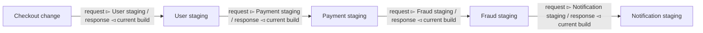
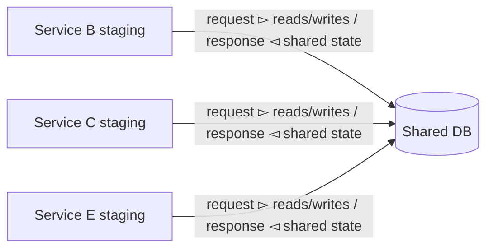
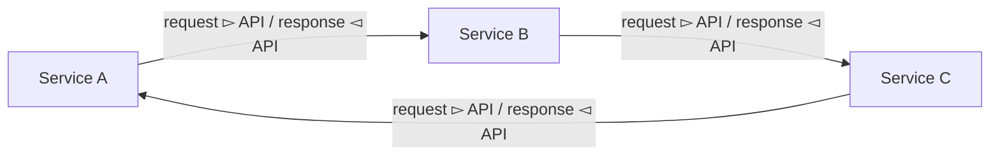
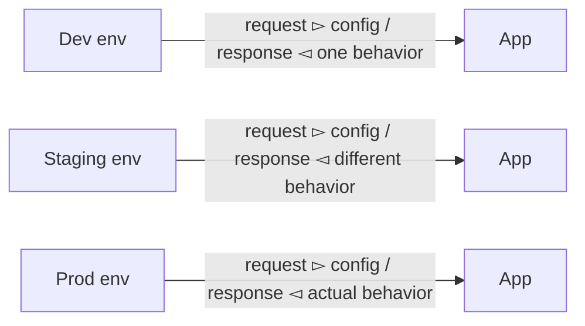
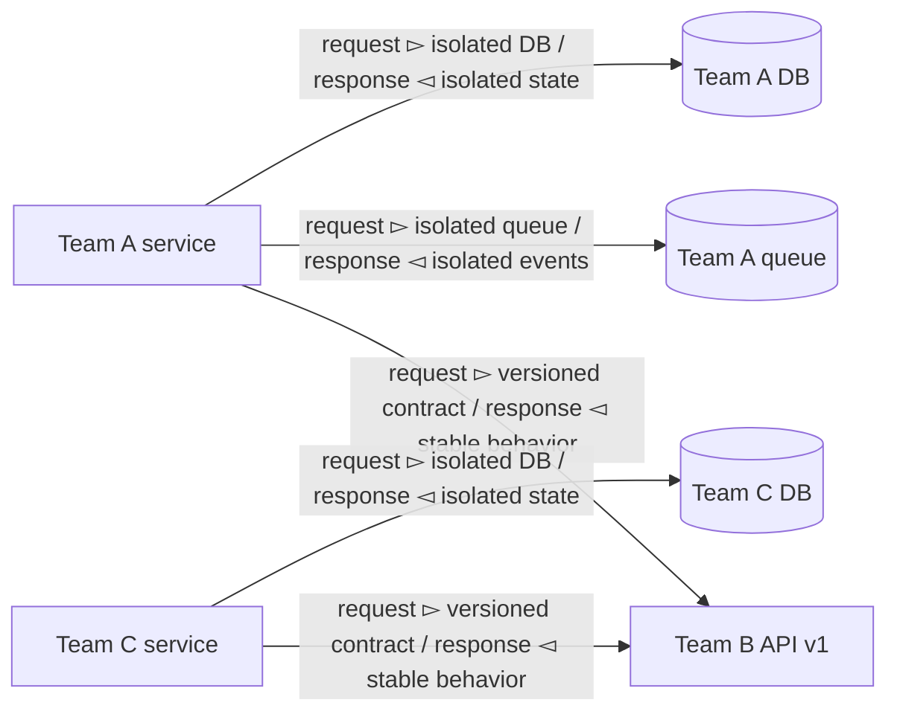

# Environment Fragmentation Defined

You pip install a library from a stranger on the internet. It works. You npm install a package from a maintainer you've never met. It works. You docker pull an image from a random GitHub repo. It works. You use a third-party public REST API. It works.

So why can't two teams in the same organization share a staging environment?

Environment fragmentation is what happens when your lower environments stop being isolated places to test and turn into a group project. Your service can no longer move unless other teams' dev, QA, or staging deployments cooperate.

---

## The core problem

A lower environment should answer this question:

> Can my team validate our change safely and independently?

If the answer is:

- only after auth updates staging
- only after payments republishes test data
- only if search doesn't refresh their schema today
- only if everyone stays on the same version for a week

then the environment is fragmented.

---

## The four common ways it happens

### 1. Artifact chaining

This is the most obvious one.

Your service in dev depends on another team's unreleased service in staging. Then that team depends on another unreleased thing. Soon your test path is chained across half the org.

One unrelated deploy breaks your test. Nobody knows if the failure is your change or their unfinished change. Testing becomes "synchronize all the things."

This is the group project version of software delivery.

---

### 2. Shared fan-in

Several services depend on one shared lower-env resource.

One team's migration becomes everyone's problem. Test data collides. Cleanup scripts erase someone else's scenario. Upgrades require synchronized timing.

It's shared state pretending to be a platform.

---

### 3. Dependency cycles

This is worse because now coordination isn't just operational, it's structural.

A can't change safely without understanding C. C can't change safely without understanding A. There is no clean rollout order.

Conway's Law shows up here: if teams need constant synchronous coordination, the dependency graph will start to reflect that social structure. The fragmented environment isn't random. It's a mirror of the organization.

---

### 4. Environment drift

Even if nobody is directly blocked, lower envs often become fake worlds.

Staging has different feature flags, different retry settings, different auth config, different data volume, different timeout behavior, different infra shape. Slowly, "works in staging" stops meaning anything. Teams optimize for passing an artificial environment. The real test only happens in prod.

That's not a confidence system. That's theater.

---

## What a good model looks like

### 1. Depend on stable contracts (i.e. formal releases)

Not on another team's active branch in environment form.

### 2. Isolate mutable resources

Each team gets its own test data, queue, tenant, schema, topic, namespace, or instance where needed.

### 3. Make breaking changes create new versions

Don't "upgrade in place" if that forces all consumers to move together.

### 4. Keep the dependency graph acyclic

A service graph that forms a web will also create a coordination web.

### 5. Treat shared staging as optional, not central

Useful for smoke checks, not the foundation of team independence.

Teams still integrate, but they do not share unfinished state. Coordination becomes intentional, not constant.

---

## A practical test

Ask this:

> What must be true before my team can test a change?

If the answer is mostly about **your own code and your own data**, you're in decent shape.

If the answer includes:

- another team deploying first
- another team freezing changes
- another team restoring data
- another team staying compatible with your staging branch
- a shared environment being in "the right state"

then you have environment fragmentation.

---

## The shortest version

Your environment is fragmented when testing requires meetings.

Your production microservices are independently deployable. Your lower environments should be too.
