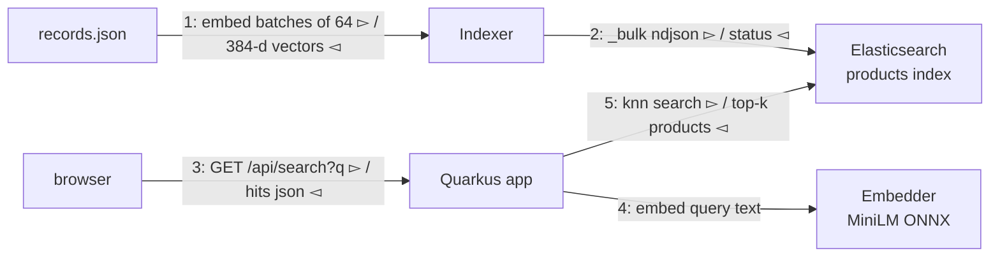

# Semantic Product Search with Elasticsearch kNN and Quarkus

[Sentence Embeddings in Pure Java with ONNX Runtime](/#article/java-onnx-embeddings) ended with an `embedBatch` method and two promises: bucket the texts, and use them for real. This post keeps both. It takes the public Algolia ecommerce dataset, embeds all 10,000 products on the batch path, bulk-indexes the vectors into an Elasticsearch `dense_vector` field, and serves kNN search from a small Quarkus application with a plain HTML page in front.

No BM25, no hybrid tricks — just vectors in, vectors out. The result answers queries that share zero words with any product name.

## Versions

| Component | Version |
|-----------|---------|
| JDK | 25.0.2 |
| Maven | 3.9.16 |
| Quarkus | 3.39.4 |
| Elasticsearch | 9.5.4 (Docker) |
| com.microsoft.onnxruntime:onnxruntime | 1.30.0 |
| ai.djl.huggingface:tokenizers | 0.38.0 |
| Dataset | [algolia/datasets](https://github.com/algolia/datasets) `ecommerce/records.json` |

## Architecture



Three pieces, one shared class. `Embedder` holds the tokenizer and the ONNX session and does masked mean pooling — the same math validated against Python in the previous post. The `Indexer` main uses it to embed the catalog; the Quarkus resource uses it to embed query text. Elasticsearch is reached over plain HTTP with `java.net.http` and Jackson, so every request stays readable — no client library hiding the wire format.

## The Dataset

Algolia publishes its demo ecommerce catalog on GitHub. This one file holds everything:

```bash
mkdir -p data && curl -L -o data/records.json \
  https://raw.githubusercontent.com/algolia/datasets/master/ecommerce/records.json
```

10,000 products with `name`, `description`, `brand`, `price`, `categories`, and an `image` URL. The embedded text per product is `name + ". " + description`: median 300 bytes, maximum 706. That is roughly 60–80 tokens, comfortably inside the model's 512-token window, so no truncation policy is needed here.

## Start Elasticsearch

```bash
docker run -d --name es9 -p 9200:9200 \
  -e discovery.type=single-node -e xpack.security.enabled=false \
  -e ES_JAVA_OPTS="-Xms1g -Xmx1g" \
  docker.elastic.co/elasticsearch/elasticsearch:9.5.4
curl --retry 30 --retry-delay 2 --retry-connrefused http://localhost:9200
```

Security off is for a laptop experiment only. Do not run this anywhere reachable.

## The Mapping, and One ES 9 Gotcha

The indexer creates the index from Java so the whole setup is one command. The vector field looks like this:

```java
props.putObject("embedding")
        .put("type", "dense_vector")
        .put("dims", Embedder.DIM)
        .put("index", true)
        .put("similarity", "cosine");
```

The gotcha: on 9.5.4, the string-shorthand mapping form is rejected. `{"image": "keyword"}` fails with:

```
mapper_parsing_exception: Expected map for property [fields] on field [image] but got a class java.lang.String
```

The fix is boring and universal: every field gets the explicit object form, `{"image": {"type": "keyword"}}`. Many old snippets and blog posts still use the shorthand, so it is worth knowing what the error means when you hit it.

Cosine similarity on `dense_vector` with `index: true` gives you a kNN graph; Elasticsearch builds it as documents arrive. One detail not visible in this mapping: on Elasticsearch 9, float vectors of 384 dimensions or more are indexed as `bbq_hnsw` by default — an HNSW graph over binary-quantized vectors with automatic rescoring. The next post makes that default explicit and compares it against hand-rolled PCA.

## Indexing the Catalog

The core loop is short. Buffer 64 records, embed them in one batched ONNX call, append `_bulk` action/document line pairs, flush every 512 documents:

```java
while (records.hasNext()) {
    pending.add(records.next());
    if (pending.size() < embedBatch) {          // embedBatch = 64
        continue;
    }
    count += processBatch(pending, embedder, ndjson);
    sinceFlush += embedBatch;
    pending.clear();
    if (sinceFlush >= bulkEvery) {              // bulkEvery = 512
        flushBulk(ndjson);
        sinceFlush = 0;
    }
}

// one batch of 64 texts -> one ONNX call -> bulk lines
static int processBatch(List<JsonNode> pending, Embedder embedder, StringBuilder ndjson) throws Exception {
    String[] texts = new String[pending.size()];
    for (int i = 0; i < pending.size(); i++) {
        texts[i] = textOf(pending.get(i));      // name + ". " + description
    }
    float[][] vectors = embedder.embedBatch(texts);
    for (int i = 0; i < pending.size(); i++) {
        ndjson.append(docLine(pending.get(i), vectors[i]));
    }
    return pending.size();
}
```

A bulk line is two lines of NDJSON: an action (`{"index":{"_index":"products","_id":"..."}}`) and the document with its 384 floats. The flush checks the response for `"errors":true` — the bulk API accepts a malformed action with HTTP 200, so a status code alone is not enough.

Run it:

```bash
mvn -q compile exec:java -Dexec.mainClass=Indexer
```

```
embedded 2048 ...
embedded 4096 ...
embedded 6144 ...
embedded 8192 ...
done: 10000 docs in 46.5 s (215 docs/s) | embed 44.5 s | bulk 2.0 s
```

Embedding is 4.4 ms per product here, versus the 0.6 ms the previous post's benchmark printed. The difference is the input: the benchmark texts were 13 tokens; real product descriptions are 60–100. Transformer cost grows with sequence length, so plan bulk jobs by tokens, not by documents. Elasticsearch accepted all 10,000 documents in 2 seconds; HNSW construction happens as part of indexing.

## kNN Query Anatomy

The search request is pure JSON:

```json
{
  "size": 10,
  "_source": ["objectID", "name", "brand", "price", "categories", "image"],
  "knn": {
    "field": "embedding",
    "query_vector": [ ...384 floats... ],
    "k": 10,
    "num_candidates": 100
  }
}
```

`k` is how many results you want; `num_candidates` is how many neighbors HNSW explores per graph hop. Higher `num_candidates` means better recall and more work. On a 10k-index of 384-dim float vectors the default trade-off barely matters — with 100k or 1M products, or smaller vectors, it becomes a real dial.

## The Quarkus Application

Two small classes. A lazy singleton around the embedder:

```java
@ApplicationScoped
public class EmbeddingService {
    @ConfigProperty(name = "embedder.model-path", defaultValue = "model.onnx")
    String modelPath;
    @ConfigProperty(name = "embedder.tokenizer-path", defaultValue = "tokenizer.json")
    String tokenizerPath;

    volatile Embedder embedder;

    synchronized Embedder embedder() {
        if (embedder == null) {
            embedder = new Embedder(modelPath, tokenizerPath);   // real code wraps this in try/catch
        }
        return embedder;
    }

    public float[] embed(String text) throws Exception {
        return embedder().embed(text);
    }
}
```

And one REST resource that embeds the query, posts the kNN body, and reshapes the hits:

```java
@Path("/api/search")
public class SearchResource {
    @Inject EmbeddingService embedder;
    @ConfigProperty(name = "es.url", defaultValue = "http://localhost:9200") String esUrl;
    @ConfigProperty(name = "es.index", defaultValue = "products") String index;

    @GET
    @Produces(MediaType.APPLICATION_JSON)
    public String search(@QueryParam("q") String query, @QueryParam("n") Integer n) throws Exception {
        int k = n == null || n <= 0 ? 10 : Math.min(n, 50);
        float[] vector = embedder.embed(query);

        ObjectNode body = MAPPER.createObjectNode();
        body.put("size", k);
        ObjectNode knn = body.putObject("knn");
        knn.put("field", "embedding");
        knn.put("k", k);
        knn.put("num_candidates", 100);
        knn.set("query_vector", MAPPER.valueToTree(vector));

        HttpRequest request = HttpRequest.newBuilder(URI.create(esUrl + "/" + index + "/_search"))
                .header("Content-Type", "application/json")
                .POST(HttpRequest.BodyPublishers.ofString(body.toString()))
                .build();
        HttpResponse<String> res = HTTP.send(request, HttpResponse.BodyHandlers.ofString());

        ArrayNode out = MAPPER.createArrayNode();
        for (JsonNode hit : MAPPER.readTree(res.body()).path("hits").path("hits")) {
            ObjectNode item = out.addObject();
            item.put("score", hit.path("_score").asDouble());
            hit.path("_source").fields().forEachRemaining(e -> item.set(e.getKey(), e.getValue()));
        }
        return out.toString();
    }
}
```

Quarkus serves a tiny HTML page next to the API. It fetches `/api/search` and lists name, brand, price, and score. The complete code lives in `_code/es-knn-quarkus/` — run `mvn package && java -jar target/quarkus-app/quarkus-run.jar`, then open `http://localhost:8080`.

## Search Results

The first thing to try is a query whose words appear nowhere in the catalog:

```bash
curl "localhost:8080/api/search?q=gift+for+a+coffee+lover&n=3"
```

```
0.7795  Mr. Coffee - 12-Cup Coffeemaker - Black
0.7731  Mr. Coffee - Brew Pour and Go Single-Serve Coffeemaker - Black
0.7726  Mr. Coffee - 12-Cup Coffeemaker - Black
```

```bash
curl "localhost:8080/api/search?q=keep+my+kids+busy+on+a+long+flight&n=3"
```

```
0.6878  LeapFrog - Disney Planes Interactive Storybook - Multi
0.6555  Discovery Kids - Exploration Laptop - Aqua
0.6515  Discovery Kids - Activity Laptop - Purple
```

```bash
curl "localhost:8080/api/search?q=quiet+keyboard+for+office+work&n=5"
```

```
0.7553  Logitech - Living-Room K410 Wireless Keyboard - Black
0.7525  Logitech - K800 Wireless Illuminated Keyboard - Black
0.7454  Corsair - Strafe RGB MX Silent Gaming Keyboard - Black
0.7433  Logitech - Wireless All-In-One Keyboard - Black
0.7411  Celluon - Epic Wireless Projection Keyboard - Silver
```

And `protect my phone screen` returns phone cases, top score 0.7884. None of these match on keywords: "gift", "lover", "flight", "quiet", "protect" do not appear in the returned product names. The embeddings did the work. A warm query returns in about 10 ms end to end — that is the full path of browser request, model inference on the query text, HNSW search, and JSON serialization.

A note on the scores: they are cosine similarity between unnormalized vectors, so the absolute numbers sit in a band (0.6–0.8 for good matches on MiniLM). The ranking is the useful part, not the value.

## What Comes Next

The 384-dim vectors are honest but heavy: similarity scoring touches 384 floats, and the uncompressed HNSW graph would hold all of them in memory. Elasticsearch 9's default `bbq_hnsw` already compresses that memory picture to 1 bit per dimension — but is quantization the only way down? The next post shrinks the vectors themselves with PCA instead of retraining anything, and measures what each approach costs in result quality. This exact index and query path is the baseline for that comparison.

## References

- [Elasticsearch: dense vector field](https://www.elastic.co/docs/reference/elasticsearch/mapping-reference/dense-vector) — official mapping and `index_options` reference
- [Elasticsearch: kNN search](https://www.elastic.co/docs/solutions/search/vector/knn) — official kNN query documentation, including `num_candidates` semantics
- [Elasticsearch bulk API](https://www.elastic.co/docs/api/doc/elasticsearch/operation/operation-bulk) — NDJSON format and the per-item `errors` flag
- [Quarkus REST reference](https://quarkus.io/guides/rest) — official guide for the resource and CDI classes used here
- [algolia/datasets](https://github.com/algolia/datasets) — the public demo catalog (ecosystem source: Algolia's own sample data, redistributed under their repo license)
- [Sentence Embeddings in Pure Java with ONNX Runtime](/#article/java-onnx-embeddings) — the `Embedder` class and its Python-validated batch math
- [Computing Embeddings in Pure Zig Without Python](/#article/zig-onnx-embeddings) — where the series started
