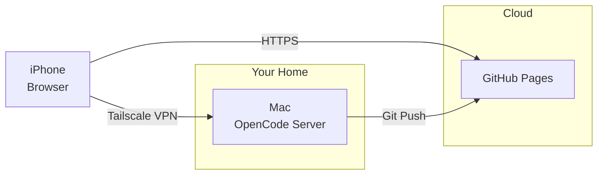

# How to Blog From Your Phone for Free



Here's a wild thought: you can write and publish blog posts from your iPhone, on your couch, using your Mac as a remote server - all for zero dollars. The AI does the work. Let me show you how.

## The Stack

- **Tailscale** - Free VPN to reach your Mac anywhere
- **OpenCode** - AI coding assistant that runs as a server
- **OpenCode Zen** - LLM gateway with curated models for coding agents
- **GitHub Pages** - Free hosting

## Step 1: Connect Your Devices With Tailscale

Tailscale creates a secure mesh VPN between your devices. It's free for personal use.

### On Your Mac

Install and start:

```bash
brew install tailscale
sudo tailscaled --socket /var/run/tailscaled.sock
tailscale up
```

This opens a browser to authenticate. Use your GitHub or Google account.

Get your Mac's Tailscale IP:

```bash
tailscale ip -4
```

### On Your iPhone

Download "Tailscale" from the App Store. Sign in with the same account. Toggle it on.

Now your iPhone can reach your Mac at `100.x.x.x` (your Tailscale IP).

## Step 2: Run OpenCode on Your Mac

Prevent your Mac from sleeping:

```bash
caffeinate -i
```

Start the OpenCode server:

```bash
opencode serve --hostname 0.0.0.0
```

## Step 3: Access From Your iPhone

Open your browser and go to:

```
http://100.X.X.X:53640
```

Replace with your Mac's Tailscale IP.

## Step 4: Let the AI Do Everything

This is the key part. You don't need to do any of the technical work. Just tell the AI what you want:

> "Write a blog post about [topic]. Save it to _posts/my-new-post.md, then commit and push to the repo."

The AI will:
1. Write your article in markdown
2. Save it to the correct location
3. Run `git add . && git commit -m "new post" && git push`

That's it. **big pickle** (the model running this) did all of that just now. What a chad.


