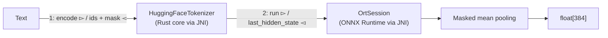

# Sentence Embeddings in Pure Java with ONNX Runtime

[Computing Embeddings in Pure Zig Without Python](/#article/zig-onnx-embeddings) built a sentence-embedding pipeline in Zig on top of the ONNX Runtime C API. A fair question follows: do you need any of that? ONNX Runtime ships an official Java API, and the Hugging Face tokenizer is reachable from Java too.

This post does the same job in pure Java — two Maven dependencies, zero native build steps — and validates every number against a Python reference script. It ends with a batched `embedBatch` method that embeds many texts in one model call, which is exactly what the next post needs to index 10,000 products into Elasticsearch.

## Versions

| Component | Version |
|-----------|---------|
| JDK | 25.0.2 (also runs on 17) |
| Maven | 3.9.16 |
| com.microsoft.onnxruntime:onnxruntime | 1.30.0 |
| ai.djl.huggingface:tokenizers | 0.38.0 |
| Python reference | tokenizers 0.23.2, onnxruntime 1.30.0 |
| Model | Xenova/all-MiniLM-L6-v2, Q4 ONNX |

The `model.onnx` and `tokenizer.json` files are the same ones the Zig post used:

```bash
curl -L -o model.onnx https://huggingface.co/Xenova/all-MiniLM-L6-v2/resolve/main/onnx/model_q4.onnx
curl -L -o tokenizer.json https://huggingface.co/Xenova/all-MiniLM-L6-v2/resolve/main/tokenizer.json
```

## Architecture



Two facts make the cross-post comparison meaningful:

- The ONNX Runtime Java package is a JNI wrapper around the same native engine the Zig post called through the C API. Same graph execution, same kernels — so identical output is the expectation, not luck.
- The DJL `tokenizers` artifact is a JNI binding to the official Hugging Face Rust tokenizer. It *is* the reference tokenizer, so the normalizer (lowercase + accent stripping), WordPiece continuations, and `[CLS]`/`[SEP]` handling match `transformers` by construction.

The model contract: inputs `input_ids`, `attention_mask`, `token_type_ids` as `[batch, seq]` int64, output `last_hidden_state` as `[batch, seq, 384]` float32.

## Dependencies

```xml
<dependency>
    <groupId>com.microsoft.onnxruntime</groupId>
    <artifactId>onnxruntime</artifactId>
    <version>1.30.0</version>
</dependency>
<dependency>
    <groupId>ai.djl.huggingface</groupId>
    <artifactId>tokenizers</artifactId>
    <version>0.38.0</version>
</dependency>
```

That is the whole build. No compiler, no `brew install`, no `-Dort-prefix`. The jars (53 MB + 18 MB) bundle the native libraries for Linux, macOS, and Windows, so the same artifact coordinates work everywhere.

## Tokenizing

```java
tokenizer = HuggingFaceTokenizer.newInstance(Path.of("tokenizer.json"));

Encoding encoding = tokenizer.encode("hello world");
long[] ids = encoding.getIds();              // 101 7592 2088 102
long[] mask = encoding.getAttentionMask();   // 1 1 1 1
```

`newInstance` reads the tokenizer.json file — the same file the model ships with — and applies its complete pipeline. Accented input is handled by the declared normalizer:

```
"café crème" → 101 7668 13675 21382 102
```

The `é` characters fold to `e` before WordPiece runs, exactly like the Python `tokenizers` library produces.

## One embedding per call

```java
public float[] embed(String text) throws Exception {
    return embedBatch(new String[] { text })[0];
}
```

Single texts go through the batch path with one row, so there is only one pooling implementation to keep correct.

## Batched inference

BERT models accept a batch dimension natively. The ONNX graph takes `[batch, seq_len]`, and texts of different lengths share one rectangular tensor by padding with `[PAD]` (id 0) and marking the pads in the attention mask.

```java
public float[][] embedBatch(String[] texts) throws Exception {
    Encoding[] encodings = tokenizer.batchEncode(texts);

    int maxLen = 0;
    for (Encoding e : encodings) {
        maxLen = Math.max(maxLen, e.getIds().length);
    }

    int batch = encodings.length;
    long[] ids = new long[batch * maxLen];
    long[] mask = new long[batch * maxLen];
    long[] typeIds = new long[batch * maxLen];
    int[] realLen = new int[batch];

    for (int b = 0; b < batch; b++) {
        long[] bIds = encodings[b].getIds();
        long[] bMask = encodings[b].getAttentionMask();
        System.arraycopy(bIds, 0, ids, b * maxLen, bIds.length);
        System.arraycopy(bMask, 0, mask, b * maxLen, bMask.length);
        for (long m : bMask) {
            realLen[b] += (int) m;
        }
    }

    float[][] out = new float[batch][DIM];
    long[] shape = { batch, maxLen };
    try (OnnxTensor inputIds = OnnxTensor.createTensor(env, LongBuffer.wrap(ids), shape);
         OnnxTensor attentionMask = OnnxTensor.createTensor(env, LongBuffer.wrap(mask), shape);
         OnnxTensor tokenTypeIds = OnnxTensor.createTensor(env, LongBuffer.wrap(typeIds), shape);
         OrtSession.Result result = session.run(
                 Map.of("input_ids", inputIds,
                        "attention_mask", attentionMask,
                        "token_type_ids", tokenTypeIds))) {

        float[][][] lastHidden = (float[][][]) result.get("last_hidden_state").orElseThrow().getValue();

        for (int b = 0; b < batch; b++) {
            for (int j = 0; j < DIM; j++) {
                float sum = 0;
                for (int i = 0; i < realLen[b]; i++) {
                    sum += lastHidden[b][i][j];
                }
                out[b][j] = sum / realLen[b];
            }
        }
    }
    return out;
}
```

Two rules keep this correct:

1. **The attention mask is the source of truth for token validity.** `batchEncode` pads the returned arrays to the longest text in the batch. Counting array lengths instead of summing masks silently treats `[PAD]` positions as real tokens.
2. **Mean pooling averages only real tokens.** The model computes garbage at padded positions; the mask keeps that garbage out of the embedding if, and only if, you divide by the mask sum rather than the padded length.

A bug story for rule 1: my first version built its own masks from array lengths. Batch results then differed from single-text results by up to 1.27 in absolute value — silently wrong, and only visible because I diffed the two paths. Deriving lengths from `getAttentionMask()` fixed it. The lesson generalizes to any BERT pipeline in any language.

## Validate against the Python reference

The reference script uses the official Python packages, the same libraries that produce the values in model documentation:

```bash
uvx --with tokenizers --with onnxruntime --with numpy python3 reference.py
```

```
embed('hello world'): -0.1761, 0.2930, 0.1513, -0.0303, -0.1342, -0.7992, 0.2508, 0.0200, -0.3306, 0.0226 | norm 5.9607
embed('The woman is walking.'): -0.0926, -0.3502, 0.0831, 0.2140, 0.4114, 0.3007, 0.1206, 0.0094, 0.0623, 0.1692 | norm 4.7223
embed('A lady is walking.'): -0.2695, -0.6615, 0.1085, 0.2927, 0.2056, 0.2454, 0.3309, -0.1328, 0.1341, 0.0831 | norm 5.1907
embed('The stock market went up.'): -0.0109, 0.1462, 0.0699, 0.4897, -0.0503, 0.0039, -0.0036, 0.1209, -0.0942, 0.0654 | norm 6.6198
embed('café crème'): -0.0938, -0.3378, -0.0020, 0.1942, 0.1332, 0.3014, 0.5538, 0.1874, 0.1194, -0.4913 | norm 6.6980
cos(walking, lady)  = 0.8864
cos(walking, stock) = 0.0364
```

And the Java program:

```bash
mvn -q compile exec:java -Dexec.mainClass=EmbedJava -Dtext="café crème"
```

```
Token IDs: 101 7592 2088 102 
Embedding (first 10 dims): -0.1761, 0.2930, 0.1513, -0.0303, -0.1342, -0.7992, 0.2508, 0.0200, -0.3306, 0.0226
Embedding norm: 5.9607

cosine("The woman is walking.", "A lady is walking.") = 0.8864
cosine("The woman is walking.", "The stock market went up.") = 0.0364

embed(café crème): -0.0938, -0.3378, -0.0020, 0.1942, 0.1332, 0.3014, 0.5538, 0.1874, 0.1194, -0.4913
```

Every value matches the Python reference at four decimal places, including the accented text. And the `hello world` numbers are the same ones the Zig post printed — one model, three host languages, one vector.

## What batching costs and saves

```bash
mvn -q compile exec:java -Dexec.mainClass=EmbedJava -Dbench=500
```

```
bench single: 500 embeddings in 0.50 s (0.99 ms per embedding)
bench batch:  500 embeddings in 0.30 s (0.59 ms per embedding)
max abs difference batch vs single: 0.0000007
```

The difference between one padded batch of 500 and 500 single calls is `0.0000007` — float32 reduction-order noise from different matrix shapes, not an algorithmic difference.

Batching saved 40% here because the benchmark texts are short and similar in length, so padding waste is small and each single call pays per-run overhead. With real product descriptions the wins grow, but two practices matter:

- **Bucket by length.** Sorting texts so each batch shares a similar `maxLen` keeps padded positions low.
- **Cap the batch.** Output is `batch × maxLen × 384` floats; batches in the tens to low hundreds keep memory predictable.

Both practices land in the next post.

## Which path to pick

| Situation | Good fit |
|-----------|----------|
| JVM application (Quarkus, Spring, plain Java) | This post: two Maven artifacts, reference tokenizer, no build step |
| Prototyping or training pipelines | The Python ecosystem, which this post uses as its correctness oracle |

All of these drive the same ONNX Runtime engine, and the values above prove they agree.

## Files

```
_code/java-onnx-embeddings/
├── pom.xml
├── src/main/java/EmbedJava.java   # tokenizer + session + pooling + bench
├── reference.py                   # Python validation script (uvx)
└── README.md
```

Model and tokenizer files are downloaded with the two `curl` commands above and are not committed.

## What Comes Next

The series continues with search: take `embedBatch` over the public Algolia ecommerce dataset, index 10,000 product vectors into an Elasticsearch `dense_vector` field, and serve kNN queries from a small Quarkus application — the query text embedded through this same pipeline.

## References

- [ONNX Runtime Java API documentation](https://onnxruntime.ai/docs/api/java/) — official reference for `OrtEnvironment`, `OrtSession`, `OnnxTensor`
- [microsoft/onnxruntime](https://github.com/microsoft/onnxruntime) — the engine and its Java bindings
- [DJL Hugging Face Tokenizers](https://docs.djl.ai/master/extensions/tokenizers/index.html) — official binding of the Rust `tokenizers` library for Java
- [Hugging Face tokenizers documentation](https://huggingface.co/docs/tokenizers) — the reference tokenizer, and its Python package used as the oracle here
- [Xenova/all-MiniLM-L6-v2](https://huggingface.co/Xenova/all-MiniLM-L6-v2) — model and tokenizer files (ecosystem conversion of the official [sentence-transformers/all-MiniLM-L6-v2](https://huggingface.co/sentence-transformers/all-MiniLM-L6-v2))
- [sentence-transformers pooling documentation](https://www.sbert.net/docs/package_reference/base_models.html) — mean pooling semantics this post reproduces
- [Computing Embeddings in Pure Zig Without Python](/#article/zig-onnx-embeddings) — the same pipeline built from the native side
