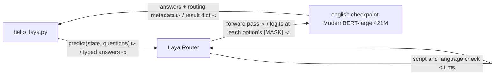

# Laya Hello World: A Non-Autoregressive System 1 Decision in 35 ms

Hello world means print. With [Laya](https://github.com/NandhaKishorM/laya) it does not. Laya is an open-source, non-autoregressive "System 1" decision model from Convai Innovations. It never generates text. You give it a state (a ticket, an email, a document) and typed questions, and it answers every question in a single forward pass. So the hello world is a decision: route a support ticket, in milliseconds, with calibrated probabilities.

I ran it end to end on an Apple Silicon Mac with uv. This post shows the setup, an editable request file, the real output I measured, and the limits the project itself documents.

## What Laya is

Daniel Kahneman's System 1 is fast, instinctive judgement. System 2 is slow, deliberate reasoning. Large language models are System 2 machines: they generate token by token, and you parse their output. Laya is a System 1 machine: a bidirectional encoder (ModernBERT-large, 421M parameters) with a decision head. Every answer option is scored at its own `[MASK]` token, then softmaxed. There is nothing to parse and nothing to hallucinate, because no text is produced.

Three question types exist:

| Primitive | Output | Typical use |
|-----------|--------|-------------|
| `choice`  | top label plus a probability per option | department routing, intent classification |
| `score`   | expected level on an ordinal rubric | urgency, frustration, severity |
| `noul`    | calibrated P(true) from 0.0 to 1.0 | churn risk, phishing detection, guardrails |

The model ships as three checkpoints — english, multilingual (100+ languages), and typed-decisions — and a `Router` picks one per request. Training uses RLCD: reinforcement learning against strictly proper scoring rules, so honest probabilities maximise the reward. Apache 2.0, weights on Hugging Face.

## Setup with uv

Laya needs Python 3.10 or newer. I pinned 3.11, the version their own Dockerfile uses, and let uv provision the interpreter. No system Python is touched.

```bash
uv venv --python 3.11 .venv
uv pip install --python .venv/bin/python laya
.venv/bin/python -I -c "import laya, torch; print(laya.__version__, torch.__version__)"
# 0.3.20 2.14.0
```

On macOS the default ARM64 torch wheel already includes the MPS backend, so `torch.backends.mps.is_available()` reports `True` with no extra flags. The first `predict` call downloads the routed checkpoint — about 800 MB for english — from Hugging Face. No account or token is needed.

## The editable prompt: request.json

No code changes to try new inputs. The state and the questions live in one JSON file:

```json
{
  "state": "Hi, we were billed twice for March. Please refund the duplicate today or we will cancel our plan.",
  "questions": {
    "department": {
      "type": "choice",
      "instructions": "Which department should handle this?",
      "criteria": {
        "billing": "invoices, payments, refunds",
        "technical": "bugs, outages, system errors",
        "other": "everything else"
      }
    },
    "urgency": {
      "type": "score",
      "instructions": "How urgent is this?",
      "criteria": ["not urgent", "soon", "blocking"]
    },
    "churn_risk": {
      "type": "noul",
      "instructions": "Does the user threaten to cancel or leave?"
    }
  }
}
```

The complete runnable code lives in `_code/laya-hello-world/`: the full runner (`hello_laya.py`), the routing-only demo (`route_only.py`), and three ready-made requests. Each script carries a PEP 723 header, so uv builds the environment for you — no venv to manage. The trimmed core looks like this:

```python
import json, time
from pathlib import Path
from laya import Router

req = json.loads(Path("request.json").read_text())
router = Router(device="mps")          # or cpu; default auto-selects

t0 = time.perf_counter()
result = router.predict(req["state"], req["questions"])
print(f"{(time.perf_counter() - t0) * 1000:.0f} ms")

print(result["routing"]["model"], "-", result["routing"]["reason"])
for name, ans in result["answers"].items():
    print(name, "->", {k: v for k, v in ans.items() if k in ("choice", "score", "noul", "confidence")})
```

## First decision: real output

The cold call (download plus load) took 95 s on first run. Every warm run afterwards was fast. Output from my Mac on the refund ticket:

```text
routed : english  (English Latin text)
answers:
  department     choice -> 'billing'  conf=0.9267
                          [billing: 0.987, technical: 0.008, other: 0.005]
  urgency        score  -> 1.7722 / 2.0  conf=0.4714
  churn_risk     noul   -> p(true)=0.879
usage  : {'input_tokens': 164, 'output_tokens': 0}
```

Three things stand out. First, `output_tokens: 0` — the hello-world of a non-autoregressive model literally produces no tokens. Second, one forward pass answered all three questions. Third, the score sits at 1.77 of 2.0: the model read the refund demand and the cancellation threat as near-maximal urgency.

Now edit the state in `request.json` to a crash report — same questions, same command:

```text
state: "The mobile app crashes every time I open the settings screen. Been broken for two days now."

  department     choice -> 'technical'  conf=0.7148
                          [billing: 0.029, technical: 0.926, other: 0.045]
  urgency        score  -> 1.6925
  churn_risk     noul   -> p(true)=0.069
```

The department flips to `technical` and the churn risk drops to 0.069: an annoyed reporter, not a flight risk. The answer space was defined at request time, not at training time — that is what makes it a hello world rather than a fine-tuning project.

And yes, the literal hello world works too. `{"state": "Hello, world", ...}` with the noul question "Is this a polite greeting?" answers `p(true)=0.720` in 20 ms.

## Multilingual routing without a second download

The Router detects script and language in under a millisecond, before any weights load. You can inspect the decision alone with `route()`:

```python
from laya import Router
router = Router()   # lazy: route() never downloads weights

for text in ["Please refund the duplicate charge on my invoice.",
             "मुझसे मार्च में दो बार शुल्क लिया गया, कृपया डुप्लिकेट राशि वापस करें।",
             "La aplicación se cierra cada vez que abro la configuración."]:
    r = router.route(text, questions)
    print(r.model, "-", r.reason)
```

Measured output:

```text
english      - English Latin text
multilingual - non-Latin script (devanagari, 100% of letters); the English checkpoint cannot read it
multilingual - Latin script, language not identified but 3% non-English letters; not safe for the English checkpoint
```

Why bother routing? The project's own benchmark shows the english checkpoint collapses on non-Latin scripts: Khmer scored 0.000 accuracy at 0.952 confidence. The model stays confident while wrong, so a confidence gate cannot save you. The router is the fix.

There is also a plain CLI, useful as a playground:

```bash
.venv/bin/laya "My payment failed twice" --predict --preset triage
# intent: other (p=0.529)  is_urgent: 0.234  frustration: 1.42
# refund_requested: 0.662  churn_risk: 0.155
```

## How the call flows



The routing decision happens in pure Python. The single forward pass happens once, for all questions. The result carries `routing.model`, `routing.reason`, and per-answer confidence, so every decision is explainable at the transport level.

## Apple Silicon: MPS works, the fast path does not

I measured the same request with `device="mps"` and `device="cpu"` on an Apple Silicon Mac, english checkpoint cached:

| Device | Cold (load + first call) | Warm call |
|--------|--------------------------|-----------|
| MPS    | ~2.3–2.9 s               | **34–44 ms** |
| CPU    | ~2.2 s                   | 119 ms    |

So Laya does take advantage of Apple Silicon through torch's MPS backend — roughly 3x faster than CPU on this machine. Two caveats from the official docs:

- The TileLang GPU fast path (`laya[fast]`, CUDA graphs and fused kernels) is NVIDIA-CUDA-only and "falls back to the stock forward on CPU/MPS". Mac users do not get it.
- Preloading all three checkpoints (`Router(preload=True)`) keeps every language switch under a millisecond of detection cost; on a laptop, lazy loading keeps memory lower. Their docs budget 8 GB RAM for the full CPU setup.

At 34 ms warm on a laptop GPU, a 400M-parameter encoder answers three decisions faster than an eyeblink — while a chat model would still be composing its first token.

## Honest limits

The project documents its own weaknesses, and I hit one immediately. On load, the runtime warns:

```text
RuntimeWarning: laya: this checkpoint ships invalid temperatures ... Treat confidence
from the affected entries as uncalibrated.
```

So read that 0.927 confidence with care. The shipped checkpoints are over-confident, and the docs recommend fitting calibration temperatures on your own data before you gate on them. Other documented limits:

- **Zero-shot is not magic.** On the typed-decisions benchmark the base english checkpoint scores 0.362 accuracy — below the 0.461 majority-class baseline. The fine-tuned `laya-typed-decisions` checkpoint reaches 0.766. Laya is a fast base to specialise, not a finished decision engine for your domain.
- **Many-option choices degrade.** Options share a token budget (`head_max_len`), so a 77-option question like Banking77 gives each label about 3–4 tokens and accuracy falls to 0.425.
- **`noul` can follow its option labels** (`false`/`true`) instead of the state on some inputs. Verify on your data; the docs suggest a two-option `choice` as a workaround.
- **Long documents need care.** The english checkpoint truncates at 512 tokens; `predict_long` and the multilingual `max_len=8192` exist, with measured accuracy drop-off past ~4,000 tokens.

These are unusually candid for a project launch, and they make the numbers above trustworthy.

## Try it yourself

From the repository root, one command runs everything — uv resolves Python 3.10+ and installs `laya` itself:

```bash
cd _code/laya-hello-world
uv run --python 3.11 hello_laya.py                    # refund ticket
uv run --python 3.11 hello_laya.py --request request-crash.json
uv run --python 3.11 hello_laya.py --device cpu       # compare with MPS
uv run --python 3.11 route_only.py                    # routing, no downloads
```

Then edit `request.json` — the state text and the typed questions — and re-run. No Python code changes. The first `predict` downloads the english checkpoint (~800 MB); warm calls take ~35 ms on Apple Silicon.

A hello world is normally about printing what you already know. This one is about deciding what you did not expect, in one pass, before the LLM has finished saying hello.

## References

- [NandhaKishorM/laya](https://github.com/NandhaKishorM/laya) — official GitHub README (install, quickstart, benchmarks, honest limits).
- [convaiinnovations/laya](https://huggingface.co/convaiinnovations/laya) — official model card with architecture and RLCD training details.
- [Laya documentation site](https://nandhakishorm.github.io/laya/) — official guides and API reference.
- [PyTorch MPS backend docs](https://pytorch.org/docs/stable/notes/mps.html) — official source for Metal acceleration on Apple Silicon.
- [ModernBERT](https://huggingface.co/microsoft/ModernBERT-large) — the backbone encoder, official release by Microsoft and Answer.AI.
- Secondary: the author's [dev.to write-up](https://dev.to/nandakishor_m_6cc0adfde9f/i-built-non-autoregressive-decision-models-a-year-ago-then-a-frontier-lab-called-it-a-18me) on the model's history and the Jev comparison. Ecosystem benchmark numbers (TypeSafe Jev) are third-party published and flagged as such in the README.
