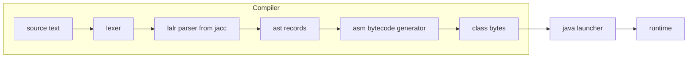

# Custom Languages in the LLM Era: From Grammar to JVM Bytecode

Compilers used to be a year-long course. In the era of LLMs, a working language — lexer, LALR parser, and real JVM bytecode output — fits in one afternoon. This post walks the full pipeline with a small proof of concept: a scripting language with `while` loops, `if`, arithmetic, and a Rust-style tail expression that compiles to a genuine, runnable `.class` file. Toolchain: Java 21, the [jacc](https://xbib.org/joerg/jacc) parser generator, and [ASM](https://asm.ow2.io/) for bytecode.

The complete project is in `_code/poc-jacc`. The goal is not a production compiler. The goal is to show how little machinery a custom language needs today, and then to ask what that means when LLMs can write the machinery for you.

## The Language

The language is deliberately small: statements, integer expressions, and one result expression at the end.

```
total = 0;
i = 10;
while (0 < i) {
    total = total + i;
    i = i - 1;
}
total
```

The trailing `total` with no semicolon is the script's value, like the last expression in a Rust block. There is no `return` statement and no special `result` variable — position decides the result. The script above compiles to a class with `public static int run()` returning `55`.

The grammar, in the same shape as the `.jacc` file:

```
program : stmt* expr
stmt    : IDENT '=' expr ';'
        | 'if' '(' expr ')' stmt
        | 'while' '(' expr ')' stmt
        | '{' stmt* '}'
expr    : NUMBER
        | IDENT
        | expr '+' expr
        | expr '-' expr
        | expr '<' expr
        | expr '>' expr
        | '(' expr ')'
```

Every value is an `int`. There is no boolean type — comparisons produce `1` or `0`, C-style. Assignment is a statement, not an expression, so `x = (y = 5);` does not parse.

## The Pipeline



One pipeline, three ingredients:

- a **hand-written lexer** that turns characters into tokens,
- an **LALR parser generated by jacc** from a `TinyParser.jacc` grammar, producing a **sealed record hierarchy** (AST),
- an **ASM-based compiler** that walks the AST and emits real bytecode.

### Project layout

| File | Role |
| --- | --- |
| `src/main/resources/TinyParser.jacc` | Grammar source; jacc compiles it into `TinyParser.java` and `TinyTokens.java` during `generate-sources`. |
| `src/main/java/com/example/TinyLexer.java` | Hand-written lexer implementing the generated `TinyTokens` interface. |
| `src/main/java/com/example/AST.java` | Sealed `Node`/`Expr`/`Stmt` hierarchy of records plus the `Program` record. |
| `src/main/java/com/example/TinyCompiler.java` | Walks the AST and emits bytecode with ASM: `run()`, plus a `main(String[])` that calls and prints it. |
| `src/main/java/com/example/Main.java` | Entry point: script in via `InputStream`, bytecode out via `OutputStream`. |

## The Lexer

The lexer is the only handwritten tokenizer in the project, and it is small: skip whitespace, read an integer or an identifier, map `if`/`while` to keywords, return everything else as a single character code.

```java
public int nextToken() {
    try {
        int c;
        do {
            c = reader.read();
        } while (Character.isWhitespace(c));

        if (c == -1) {
            return token = ENDINPUT;
        }

        if (Character.isDigit(c)) {
            var val = 0;
            while (Character.isDigit(c)) {
                val = val * 10 + (c - '0');
                reader.mark(1);
                c = reader.read();
            }
            reader.reset();
            semanticValue = val;
            return token = NUMBER;
        }

        if (Character.isLetter(c)) {
            var sb = new StringBuilder();
            while (Character.isLetterOrDigit(c)) {
                sb.append((char) c);
                reader.mark(1);
                c = reader.read();
            }
            reader.reset();
            var id = sb.toString();
            return token =
                switch (id) {
                    case "if" -> IF;
                    case "while" -> WHILE;
                    default -> {
                        semanticValue = id;
                        yield IDENTIFIER;
                    }
                };
        }

        semanticValue = null;
        return token = c;
    } catch (IOException e) {
        return token = ENDINPUT;
    }
}
```

Two details shape the interface: `TinyLexer` implements the generated `TinyTokens` interface, and the generated parser drives it by calling `nextToken()` once, then reading `getToken()` and `getSemanticValue()`. The `Reader.mark(1)`/`reset()` pair is a one-character lookahead that lets the lexer read past the last digit or letter without losing it.

## The Grammar and jacc's Quirks

jacc is the Java port of the classic `yacc`/`jacc` LALR generator: you write a grammar, it emits a table-driven parser. The `%{ %}` preamble at the top holds package and import statements only — jacc emits its own class wrapper, so anything else there would double-declare the class:

```
%package com.example
%class TinyParser
%interface TinyTokens
%semantic Object : lexer.getSemanticValue()

%token <Integer> NUMBER
%token <String> IDENTIFIER
%token IF WHILE

%left '+' '-'
%left '<' '>'

%type <AST.Stmt> stmt block
%type <AST.Program> program
%type <AST.Expr> expr
%type <List> stmt_list

%next lexer.nextToken()
```

Several conventions matter and are not obvious from the CLI alone:

- `%package com.example` is required so both generated files share a package. Without it, `TinyTokens.java`, written by a separate writer than `TinyParser.java`, is emitted with no package statement at all.
- `%class TinyParser` and `%interface TinyTokens` are required. The bundled CLI never calls its own `setName(...)`, so without these directives the class and interface default to `nullParser` / `nullTokens`.
- `%type <List<AST.Stmt>> stmt_list` does not parse — jacc's type parser cannot handle nested generics. Use the raw `%type <List>`. It is safe because semantic values are stored as `Object`; the declared type only affects casts when *reading* `$1`, `$2`, etc., not when writing `$$`.
- The generated `parse()` method reads the *current* token via `lexer.getToken()` before doing anything else; it does not fetch one. Callers must prime the lexer with one `nextToken()` call first.

The semantic actions build records directly:

```
expr : NUMBER          { $$ = new AST.Num($1); }
     | IDENTIFIER      { $$ = new AST.Var($1); }
     | expr '+' expr   { $$ = new AST.BinOp('+', $1, $3); }
     | expr '-' expr   { $$ = new AST.BinOp('-', $1, $3); }
     | expr '<' expr   { $$ = new AST.BinOp('<', $1, $3); }
```

The precedence declarations deserve a warning. In jacc, later declarations bind tighter, so:

```
%left '+' '-'
%left '<' '>'
```

makes `<` bind **tighter** than `+`, the reverse of C or Java. `1 + 2 < 3` parses as `1 + (2 < 3)` and evaluates to `2`, not `0`. A test suite catches this the first time you write a loop condition without parentheses.

## The AST as Sealed Records

The AST is a textbook use of Java 21's sealed hierarchies and records — the parser produces it, the compiler consumes it, and pattern matching in `instanceof` dispatches on it:

```java
public sealed interface Node permits Expr, Stmt {}

public sealed interface Expr extends Node permits Num, Var, BinOp {}

public sealed interface Stmt extends Node permits Assign, If, While, Block {}

public record Num(int value) implements Expr {}

public record Var(String name) implements Expr {}

public record BinOp(char op, Expr left, Expr right) implements Expr {}

public record Assign(String var, Expr expr) implements Stmt {}

public record If(Expr cond, Stmt thenBranch) implements Stmt {}

public record While(Expr cond, Stmt body) implements Stmt {}

public record Block(List<Stmt> stmts) implements Stmt {}

public record Program(List<Stmt> stmts, Expr tail) {}
```

The sealed hierarchy is what makes the compiler's exhaustive dispatch readable: every `instanceof` chain in `TinyCompiler` covers exactly the cases the grammar can produce.

## The Compiler: Bytecode With ASM

`TinyCompiler` follows the classic register-allocation-on-the-cheap strategy: script variables become local variable slots in `run()`. The symbol table maps names to slots, starting at slot 1, and assignments emit `ISTORE` while references emit `ILOAD`.

Control flow is plain label arithmetic. A `while` loop is a loop label, a condition test, and a jump:

```java
} else if (node instanceof AST.While whileStmt) {
    var labelLoop = new Label();
    var labelEnd = new Label();

    mv.visitLabel(labelLoop);
    compileExpr(whileStmt.cond(), mv);
    mv.visitJumpInsn(IFEQ, labelEnd);

    compileStmt(whileStmt.body(), mv);
    mv.visitJumpInsn(GOTO, labelLoop);
    mv.visitLabel(labelEnd);
}
```

There is no boolean type, so comparisons materialize `1`/`0` explicitly — jump to a `1`-emitting label on the condition, fall through to a `0`:

```java
private void compileComparison(MethodVisitor mv, int comparisonOpcode) {
    var labelTrue = new Label();
    var labelEnd = new Label();
    mv.visitJumpInsn(comparisonOpcode, labelTrue);
    mv.visitLdcInsn(0);
    mv.visitJumpInsn(GOTO, labelEnd);
    mv.visitLabel(labelTrue);
    mv.visitLdcInsn(1);
    mv.visitLabel(labelEnd);
}
```

Finally, every generated class gets a `main` that prints `run()`'s value, so the result is visible with a plain `java Tiny` — no reflection, no loader, no jshell. One detail worth keeping: the emitted class declares version `V1_8` even though the toolchain is Java 21. The generated bytecode uses only Java 8 instructions, so the *produced* class runs on any JVM from 8 up, while the *compiler* itself needs the modern JDK.

## The Whole Machine

Build with Maven on Java 21:

```
$ mvn clean package
```

The build generates `TinyParser.java` and `TinyTokens.java` from the grammar during `generate-sources`, formats the sources with `fmt-maven-plugin`, runs the tests, and produces `target/poc-jacc.jar`, a self-contained fat jar.

Then the compiler is a Unix-style filter: script in via stdin, bytecode out via stdout.

```console
$ cat <<'EOF' | java -jar target/poc-jacc.jar > Tiny.class
total = 0;
i = 10;
while (0 < i) {
    total = total + i;
    i = i - 1;
}
total
EOF

$ java Tiny
55
```

The second command is the payoff: the JVM loads `Tiny.class` off the current directory and runs the generated `main(String[])`, which calls `run()` and prints. That is real, verifiable bytecode — not an interpreter, not a tree walker.

## Testing, Including Infinite Loops

The test suite drives `Main.compile()` exactly like the CLI: script bytes in, bytecode out, then a throwaway `ClassLoader` loads the class and invokes `run()` via reflection.

```java
private static int runCompiled(byte[] bytecode, Duration timeout) throws Exception {
    var loader = new MemoryClassLoader();
    var clazz = loader.defineClass(Main.GENERATED_CLASS_NAME, bytecode);
    var method = clazz.getMethod("run");

    var executor = Executors.newSingleThreadExecutor(MainCompileTest::newDaemonThread);
    try {
        var future = executor.submit(() -> (int) method.invoke(null));
        return future.get(timeout.toMillis(), TimeUnit.MILLISECONDS);
    } finally {
        executor.shutdownNow();
    }
}
```

One test compiles a genuine infinite loop (`while (1 < 2) { }`) and asserts the invocation times out instead of hanging the suite. Because a compiled script can spin forever and the JVM has no safe way to force-stop a tight non-blocking loop, every invocation runs on an explicitly daemon thread with a bounded `Future.get(timeout, ...)`. The abandoned thread dies with the test JVM.

`mvn test` reports:

```
Tests run: 14, Failures: 0, Errors: 0, Skipped: 0
```

Fourteen tests cover the loops, the branch, the precedence quirk, the pipe contract through real `System.in`/`System.out`, and the generated `main`. The suite also caught the sort of bug that language designers meet early: writing `j < i + 1` as a loop condition compiles to `(j < i) + 1` under this grammar's precedence, an expression that is never zero — an infinite loop, found by the timeout guard rather than by a hung build.

## Why the LLM Era Changes the Economics

This is the part that made the project worth doing. Building this language used to require a compiler course, or at least a careful weekend with the dragon book. Today the loop is different:

1. You describe the language you want in plain prose to an LLM: "a tiny scripting language, `while` loops, `if`, ints only, result is the last expression".
2. The LLM drafts the lexer, the `.jacc` grammar, and the first ASM compiler. The grammar shapes are well-known, so the drafts are close.
3. You run `mvn test`, the suite tells you what is wrong, and the iteration is minutes, not weeks.

The failure modes are also friendly. LALR conflicts surface as explicit table conflicts. The precedence quirk shows up as one failing test. Undefined variables throw a clear `RuntimeException` from the compiler walk. None of it requires guessing — the machine tells you.

None of this makes compiler theory obsolete. It makes the *mechanics* cheap. The grammar still has to be right; the bytecode still has to be valid. But the cost of *trying* a custom language has collapsed from a course to an afternoon.

## The Open Question

That collapse is worth sitting with. If a competent custom language is now an afternoon of prompting and verifying, then two futures are both plausible:

- **They are dead.** LLMs can parse intent from natural language directly and execute it. A bespoke grammar is just one more layer of indirection between the user and the model, with a parser generator's quirks attached. If the agent already understands "sum the integers from one to ten", why constrain it with a grammar for a language nobody else speaks?

- **This is the golden age.** Exactly because LLMs are good at generating them, custom compilers for custom domains become cheap. A domain-specific language is a token-cheap, unambiguous vocabulary: `total = 0; while (0 < i) { ... }` costs a handful of tokens, parses without drift, and fails at compile time instead of hallucinating at inference time. For a well-bounded domain, a DSL can guide an agent into the right path at a reasonable token cost, with grammar as the guardrail.

The honest answer is that we are at the start of the experiment. The tools now exist to run it cheaply: this whole pipeline is a few hundred lines, and an LLM can scaffold it in an afternoon. Whether the next decade is full of tiny, precise domain languages — or none at all, because natural language was good enough — is an open question, and it is finally cheap enough to answer empirically.

## References

### Official Sources

- [jacc parser generator](https://xbib.org/joerg/jacc) — official source, issues, and releases
- [ASM](https://asm.ow2.io/) — bytecode manipulation framework
- [org.xbib:jacc 3.0.0 on Maven Central](https://repo1.maven.org/maven2/org/xbib/jacc/3.0.0/) — artifact used as a plugin-level dependency
- [Java 21 Language Updates: records and sealed classes](https://docs.oracle.com/en/java/javase/21/language/records.html) — Oracle documentation
- [The java launcher](https://docs.oracle.com/en/java/javase/21/docs/specs/man/java.html) — Oracle documentation

### Ecosystem Sources

- [An Incremental Approach to Compiler Construction](https://scheme2006.cs.uchicago.edu/11-ghuloum.pdf) — the classic tiny-compiler teaching paper
- [Let's Build a Simple Interpreter](https://ruslanspivak.com/lsbasi-part1/) — Ruslan Spivak's series on hand-built lexers and parsers