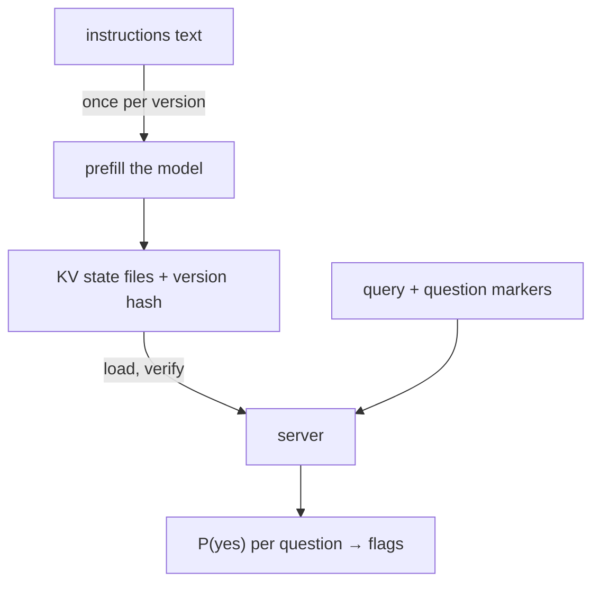

# Memoized Prefill: LLM Routing with Cached Attention State

An ecommerce search engine gets queries like `shoes under 10`, `nike air force 1`, or `gift for wife birthday`. Each one must decide: extract a price facet? run brand NER? enable fuzzy matching? use the hybrid vector route? If one wanted a single model to answer all of these per query, in one shot — where adding a new brand or a new question never means retraining — a classifier does not fit: every new question is a new training run. A causal language model can: its attention states for a fixed prefix do not depend on what comes after the prefix. Prefill is therefore a pure function of the prompt text — so compute it once, store the KV state, key it by a hash of that text, and reuse it. That is memoization, and the industry knows its runtime form as prompt caching or automatic prefix caching. Here the memo ships as versioned files instead of living in a warm cache. Every question is answered by reading logits at probe positions; no text is generated. This post documents the prototype, the prefill/serve split, why the result is deterministic by construction, and how the engine answers across four scripts.

## The engine

Two files, sharing nothing but the artifact directory. `memoize.py` prefills the instruction block once, fits one decision threshold per question against labeled queries, and writes the KV state to disk as plain tensors. `server.py` reads the directory back, verifies a hash of the instructions against the state, and answers queries — it never runs a prefill pass.

The core of every question is the probe: the query plus a short marker (`PRICE? Answer:`, `BRAND? Answer:`) appended after the memoized state; the yes/no probabilities are read from the logits at the marker's final token (`memoize.py`, lines 115–124). This is the pattern LLM rerankers use — classification from first-token logits of a causal model, with no decode loop. Scoring a multi-word option (the `choice` primitive) means teacher-forcing the option tokens and summing their log-probabilities: one probe pass per option.



The first probe wording taught a lesson worth keeping: `HYBRID` started as "Does the query need semantic vector search?" — and said yes to `sneakers`. The model was never confused about english; it was asked about *the retrieval internals*, which no token in a query carries. Every rule below states what is visible in the text. Ask about the query, not about the pipeline.

What each answer drives downstream:

- **PRICE** — the query carries a price bound. The model never extracts the number (a regex does that); the probe only says whether opening the price-facet path is worth it. `shoes under 10` → the facet arrives on the results page instead of waiting for a click.
- **BRAND** — send the query to brand NER against the dictionary and map hits to a brand facet. This is also the gate that tolerates misspellings: `addidass` only costs a dictionary lookup if BRAND fires.
- **FUZZY** — open edit-distance expansion at query time. Fuzzy is the most expensive retrieval mode to run; the probe exists to keep it off the path when every word is real.
- **LOCATION** — the query carries a place-name span. Not a location search — nobody buys a laptop by zip code. A hit means: strip the place and treat it as a modifier (regional stock, shipping), then process the rest as a normal product query.
- **CATEGORY** — the whole query is a category phrase (`sneakers`, `running shoes`). Then the user is browsing, not searching: skip text scoring and jump straight to the category drill-down with the facet panel open.
- **HYBRID** — the query describes a need, recipient, occasion, or use beyond naming products (`gift for wife`, `comfortable for long walks`). These get the vector route; bare keywords never do — a single term is a thesaurus problem, not an embedding problem.

## memoize.py

The complete file. The instruction text is deliberately long — 80 brands, categories, six rules — because that is the workload the memoized prefill exists to serve.

```python
#!/usr/bin/env python
# /// script
# requires-python = ">=3.10"
# dependencies = ["torch", "transformers"]
# ///
"""Memoize step. Prefills the instruction block ONCE and writes the KV state
to a directory of plain files. The serving script needs nothing from this
file except that directory layout:

    memo/
      instructions.txt        exact prompt text, diffable, human editable
      version.txt             sha256(model_id + dtype + instructions)[:12]
      meta.json               model id, dtype, base_len, layer count,
                              library versions, questions + thresholds
      state/layer_00_key.pt   one tensor per cache layer (keys + values)
      state/layer_00_value.pt ...
"""
import hashlib
import importlib.metadata
import json
import os
import torch
from transformers import AutoModelForCausalLM, AutoTokenizer, DynamicCache

MODEL_ID = "Qwen/Qwen2.5-1.5B-Instruct"
DEVICE = "mps" if torch.backends.mps.is_available() else "cpu"
DTYPE = torch.float16 if DEVICE == "mps" else torch.float32
OUTDIR = "memo"

BRANDS = """Nike, Adidas, Puma, Asics, New Balance, Salomon, Decathlon, Reebok,
Under Armour, Fila, Mizuno, Brooks, Saucony, Hoka, On, Merrell, The North Face,
Columbia, Patagonia, Arc'teryx, Vans, Converse, Skechers, Crocs, Birkenstock,
Clarks, Geox, ECCO, Timberland, Dr. Martens, Apple, Samsung, Sony, LG, Bosch,
Siemens, Philips, Xiaomi, OnePlus, Google, Huawei, Dell, HP, Lenovo, Asus,
Acer, Logitech, Razer, JBL, Bose, Sennheiser, Anker, Belkin, TP-Link, Netgear,
Zara, H&M, Uniqlo, Gap, Old Navy, Levi's, Wrangler, Carhartt, Dickies, IKEA,
JYSK, Leroy Merlin, C&A, Only, Vero Moda, Jack & Jones, Selected, Tommy
Hilfiger, Calvin Klein, Ralph Lauren, Lacoste, L'Oreal, Nivea, Dove, Gillette,
Oral-B, Braun, Tefal, WMF, Zwilling, Le Creuset, Pyrex, Tupperware"""

INSTRUCTIONS = """You are the query router of an ecommerce search engine.
Decide each question about the user query. User queries arrive lowercased and
whitespace-normalized; judge the words as given.

Known brands:
""" + BRANDS + """

Known categories: shoes, sandals, boots, sneakers, slippers, jackets, coats,
hoodies, t-shirts, jeans, shorts, dresses, skirts, backpacks, handbags,
wallets, watches, headphones, earbuds, speakers, phones, tablets, laptops,
monitors, keyboards, mice, televisions, fridges, washers, vacuums, cookware,
knives, towels, bedding, furniture, lamps, tools, drills, bikes, tents.

Rules:
- PRICE is yes when the query bounds a price: "under 10", "cheap", "50 to 100".
- BRAND is yes when the query mentions or hints one of the known brands,
  including a misspelled brand of something that brand makes.
- FUZZY is no when every word is a correctly spelled common word or known brand.
- FUZZY is yes when a word looks misspelled or is an unknown brand spelling.
- LOCATION is yes when a city, country, or region name appears in the query.
- CATEGORY is yes when the whole user query looks like a product category
  name or a plain category phrase: "sneakers", "running shoes", "trail boots".
- CATEGORY is no when the query adds anything beyond a category phrase: a
  price, a brand, a place, or a described need, recipient, or occasion.
- HYBRID is yes when the query describes a need, recipient, occasion, or use
  beyond naming products: "for my wife", "birthday", "long walks".
- HYBRID is no when the query only names product types, brands, model numbers,
  colors, sizes, or prices, with no described need, recipient, occasion, or use.
"""

SEMANTIC = {}   # set {"NOPLACE": "LOCATION", ...} to flip a probe's decision side

QUESTIONS = {
    "PRICE":    ["PRICE? Answer:", 0.5, False],
    "BRAND":    ["BRAND? Answer:", 0.5, False],
    "FUZZY":    ["FUZZY? Answer:", 0.5, False],
    "LOCATION": ["LOCATION? Answer:",   0.5, False],
    "HYBRID":   ["HYBRID? Answer:",     0.5, False],
    "CATEGORY": ["CATEGORY? Answer:",   0.5, False],
}

# toy labeled set; production uses hundreds of log-mined decisions
LABELS = {
    "shoes under 10":               {"PRICE": 1, "BRAND": 0, "FUZZY": 0, "LOCATION": 0, "HYBRID": 0, "CATEGORY": 0},
    "running shoes cheaper than 50": {"PRICE": 1, "BRAND": 0, "FUZZY": 0, "LOCATION": 0, "HYBRID": 0, "CATEGORY": 0},
    "nike air force 1":             {"PRICE": 0, "BRAND": 1, "FUZZY": 0, "LOCATION": 0, "HYBRID": 0, "CATEGORY": 0},
    "addidass ultraboost":          {"PRICE": 0, "BRAND": 1, "FUZZY": 1, "LOCATION": 0, "HYBRID": 0, "CATEGORY": 0},
    "running shoes from berlin":    {"PRICE": 0, "BRAND": 0, "FUZZY": 0, "LOCATION": 1, "HYBRID": 1, "CATEGORY": 0},
    "sneakers":                     {"PRICE": 0, "BRAND": 0, "FUZZY": 0, "LOCATION": 0, "HYBRID": 0, "CATEGORY": 1},
    "gift for wife birthday":       {"PRICE": 0, "BRAND": 0, "FUZZY": 0, "LOCATION": 0, "HYBRID": 1, "CATEGORY": 0},
    "comfortable shoes for long walks": {"PRICE": 0, "BRAND": 0, "FUZZY": 0, "LOCATION": 0, "HYBRID": 1, "CATEGORY": 0},
    "iphone 15 pro max":            {"PRICE": 0, "BRAND": 1, "FUZZY": 0, "LOCATION": 0, "HYBRID": 0, "CATEGORY": 0},
    "womanss handbagg":             {"PRICE": 0, "BRAND": 0, "FUZZY": 1, "LOCATION": 0, "HYBRID": 0, "CATEGORY": 1},
    "boots from madrid":            {"PRICE": 0, "BRAND": 0, "FUZZY": 0, "LOCATION": 1, "HYBRID": 1, "CATEGORY": 0},
    "cheap sandals":                {"PRICE": 1, "BRAND": 0, "FUZZY": 0, "LOCATION": 0, "HYBRID": 0, "CATEGORY": 0},
    "hoka clotree for muddy trails": {"PRICE": 0, "BRAND": 1, "FUZZY": 0, "LOCATION": 0, "HYBRID": 1, "CATEGORY": 0},
    "laptop under 3000 for student": {"PRICE": 1, "BRAND": 0, "FUZZY": 0, "LOCATION": 0, "HYBRID": 1, "CATEGORY": 0},
}

def main():
    tok = AutoTokenizer.from_pretrained(MODEL_ID)
    model = (AutoModelForCausalLM.from_pretrained(MODEL_ID, dtype=DTYPE)
             .to(DEVICE).eval())
    torch.set_grad_enabled(False)
    enc = lambda s: tok(s, add_special_tokens=False).input_ids
    yes, no = enc(" yes")[0], enc(" no")[0]

    # prefill once: this forward pass IS the memoization
    ids = torch.tensor([enc(INSTRUCTIONS)], device=DEVICE)
    cache = model(ids, use_cache=True).past_key_values
    state = [(l.keys.clone(), l.values.clone()) for l in cache.layers]
    base_len = ids.shape[1]
    print(f"memoized {base_len} tokens, {len(state)} layers")

    def probe(query, marker):
        fresh = DynamicCache()
        for i, (k, v) in enumerate(state):
            fresh.update(k, v, i)
        s = enc(f"\nUser query: {query}\n{marker}")
        pos = torch.arange(base_len, base_len + len(s), device=DEVICE).unsqueeze(0)
        logits = model(input_ids=torch.tensor([s], device=DEVICE),
                       past_key_values=fresh, position_ids=pos,
                       use_cache=False).logits[0, len(s) - 1]
        return float(torch.softmax(logits[[yes, no]].float(), -1)[0])

    # one threshold per question: balanced-accuracy sweep over the labels
    probs = {q: {n: probe(q, m) for n, (m, _, _) in QUESTIONS.items()} for q in LABELS}
    for name in QUESTIONS:
        sem = SEMANTIC.get(name, name)
        pts = [(probs[q][name], g[sem]) for q, g in LABELS.items() if sem in g]
        n1 = sum(1 for _, g in pts if g) or 1
        n0 = sum(1 for _, g in pts if not g) or 1
        flipped = QUESTIONS[name][2]
        best = max([i / 100 for i in range(10, 96)],
                   key=lambda t: 0.5 * (sum(int((p >= t) != flipped) == g for p, g in pts if g) / n1
                                        + sum(int((p >= t) != flipped) == g for p, g in pts if not g) / n0))
        QUESTIONS[name][1] = best
        print(f"  {name:9s} threshold={best:.2f}")

    os.makedirs(f"{OUTDIR}/state", exist_ok=True)
    with open(f"{OUTDIR}/instructions.txt", "w") as f:
        f.write(INSTRUCTIONS)
    version = hashlib.sha256(
        (MODEL_ID + str(DTYPE) + INSTRUCTIONS).encode()).hexdigest()[:12]
    with open(f"{OUTDIR}/version.txt", "w") as f:
        f.write(version)
    with open(f"{OUTDIR}/meta.json", "w") as f:
        json.dump({"model_id": MODEL_ID, "dtype": str(DTYPE), "device": DEVICE,
                   "base_len": base_len, "layers": len(state), "version": version,
                   "torch": str(torch.__version__),
                   "transformers": importlib.metadata.version("transformers"),
                   "normalize": "strip; lower; collapse whitespace",
                   "questions": QUESTIONS}, f, indent=2)
    for i, (k, v) in enumerate(state):
        torch.save(k.cpu(), f"{OUTDIR}/state/layer_{i:02d}_key.pt")
        torch.save(v.cpu(), f"{OUTDIR}/state/layer_{i:02d}_value.pt")
    total = sum(os.path.getsize(f"{OUTDIR}/state/{n}") for n in os.listdir(f"{OUTDIR}/state"))
    print(f"wrote {OUTDIR}/: version={version}, {len(state) * 2} state files, {total / 1e6:.1f} MB")

if __name__ == "__main__":
    main()
```

## server.py

The complete server. Note what it does **not** do: it never runs a prefill forward pass over the instruction block. The KV state is read from files, the hash of the instructions is recomputed and checked, and a mismatch is a hard error — a stale memo can never answer queries under an edited prompt (`server.py`, lines 21–43). All question probes for one query share a single batched forward: the memoized prefix is expanded to batch size (a view, not a copy) and each question gets its own padded row (lines 61–86). That is why per-request cost barely depends on instruction length.

```python
#!/usr/bin/env python
# /// script
# requires-python = ">=3.10"
# dependencies = ["torch", "transformers"]
# ///
"""Serve step. Loads the memoized directory written by memoize.py — plain
files, no shared code, no prefill. Answers every question of every query in
ONE batched forward pass over the memo.

Usage: python server.py "memo" "shoes under 10" "gift for wife birthday"
"""
import hashlib
import json
import sys
import time
import torch
from transformers import AutoModelForCausalLM, AutoTokenizer, DynamicCache

torch.set_grad_enabled(False)

def load(dirpath):
    with open(f"{dirpath}/meta.json") as f:
        meta = json.load(f)
    with open(f"{dirpath}/instructions.txt") as f:
        instructions = f.read()
    with open(f"{dirpath}/version.txt") as f:
        version = f.read().strip()
    recomputed = hashlib.sha256(
        (meta["model_id"] + meta["dtype"] + instructions).encode()).hexdigest()[:12]
    if recomputed != version or recomputed != meta["version"]:
        raise RuntimeError(f"artifact inconsistent: files say {version}, "
                           f"content hashes to {recomputed}")
    if str(meta["torch"]) != str(torch.__version__):
        raise RuntimeError(f"artifact built with torch {meta['torch']}, "
                           f"running {torch.__version__}")
    device = "mps" if torch.backends.mps.is_available() else "cpu"
    dtype = getattr(torch, meta["dtype"].split(".")[-1])
    state = [(torch.load(f"{dirpath}/state/layer_{i:02d}_key.pt",
                         map_location=device, weights_only=True),
              torch.load(f"{dirpath}/state/layer_{i:02d}_value.pt",
                         map_location=device, weights_only=True))
             for i in range(meta["layers"])]
    return meta, state, device, dtype

def main():
    args = sys.argv[1:]
    dirpath = args[0] if args and not args[0].startswith("-") else "memo"
    queries = args[1:] or ["shoes under 10"]

    t0 = time.perf_counter()
    meta, state, device, dtype = load(dirpath)
    tok = AutoTokenizer.from_pretrained(meta["model_id"])
    model = (AutoModelForCausalLM.from_pretrained(meta["model_id"], dtype=dtype)
             .to(device).eval())
    enc = lambda s: tok(s, add_special_tokens=False).input_ids
    YES = torch.tensor([enc(" yes")[0], enc(" no")[0]], device=device)
    base_len, pad = meta["base_len"], tok.eos_token_id
    print(f"loaded {dirpath}: version={meta['version']} prefix={base_len} tokens, "
          f"setup {(time.perf_counter() - t0) * 1000:.0f} ms — no prefill ran")

    def decide(query):
        query = " ".join(query.strip().lower().split())
        rows = [(name, enc(f"\nUser query: {query}\n{marker}"), thr, flip)
                for name, (marker, thr, flip) in meta["questions"].items()]
        n = len(rows)
        L = max(len(toks) for _, toks, _ in rows)
        input_ids = torch.full((n, L), pad, device=device, dtype=torch.long)
        new_mask = torch.zeros((n, L), device=device, dtype=torch.long)
        for i, (_, toks, _, _) in enumerate(rows):
            input_ids[i, :len(toks)] = torch.tensor(toks, device=device)
            new_mask[i, :len(toks)] = 1
        cache = DynamicCache()
        for i, (k, v) in enumerate(state):
            cache.update(k.expand(n, -1, -1, -1), v.expand(n, -1, -1, -1), i)
        attn = torch.cat([torch.ones(n, base_len, device=device, dtype=torch.long),
                          new_mask], dim=1)
        pos = (base_len + torch.arange(L, device=device)).unsqueeze(0).expand(n, -1)
        logits = model(input_ids=input_ids, past_key_values=cache,
                       position_ids=pos, attention_mask=attn,
                       use_cache=False).logits
        out = {}
        for i, (name, toks, thr, flip) in enumerate(rows):
            z = logits[i, len(toks) - 1, YES].float()
            p = float(torch.softmax(z, -1)[0])
            out[name] = ((p >= thr) != flip, p)
        return out

    for query in queries:
        t0 = time.perf_counter()
        answers = decide(query)
        line = " ".join(f"{n}={'Y' if flag else 'n'}({p:.2f})"
                        for n, (flag, p) in answers.items())
        print(f"  {query!r:35s} {line}  [{(time.perf_counter() - t0) * 1000:.0f} ms]")

    def bench(query, n=20, warm=3):
        for _ in range(warm):
            decide(query)
        t0 = time.perf_counter()
        for _ in range(n):
            decide(query)
        return (time.perf_counter() - t0) * 1000 / n

    a, b = decide(queries[0]), decide(queries[0])
    print(f"bench: {bench(queries[0]):.1f} ms per decide | "
          f"determinism (rerun identical): {a == b}")

if __name__ == "__main__":
    main()
```

Run `python memoize.py` once per instruction version. Deploy: ship the `memo/` directory, run `server.py`. Editing the prompt (adding a brand, a category, a question) means rerunning `memoize.py`; the server picks up the new artifact or refuses the mismatched one.

## The numbers

One host — a modern 12-core laptop-class machine with its integrated GPU, no batch queueing. Everything costs one of two things: once per version, or once per query. There is nothing else.

**Once per version** — and every brand, category, rule, or target-language example you add is a version:

- Re-prefill of the 673-token instruction block on Qwen2.5-1.5B, fp16: 296 ms, producing 56 state files, 19.4 MB.
- Threshold fitting: a few dozen probe passes over the labeled bank.

**Once per replica start:** ~50 ms to reload the whole memo into memory from files. No prefill, no warm-up, no shared cache — a tenth replica changes nobody's latency.

**Once per query:** the only recurring number in the system — six questions, one batched forward, 82 ms, measured stable while the memo grew from 648 to 673 tokens. Instructions are free at query time because they were already run; scaling out is just starting more processes that run nothing again.

## How the engine answers

The scorer runs a bank of 22 queries — six english, sixteen spanish, chinese, and hindi — with gold labels, all through one english memo, prefilled once:

```python
#!/usr/bin/env python
# /// script
# requires-python = ">=3.10"
# dependencies = ["torch", "transformers"]
# ///
"""Score the memoized engine at threshold 0.5 across four scripts.
One artifact, one english prefill, english markers, no changes to the LLM.

Usage: python causal_score.py [memo-dir]"""
import json
import sys
import torch
from transformers import AutoModelForCausalLM, AutoTokenizer, DynamicCache

torch.set_grad_enabled(False)
DIRPATH = sys.argv[1] if len(sys.argv) > 1 else "memo"
meta = json.load(open(f"{DIRPATH}/meta.json"))
device = "mps" if torch.backends.mps.is_available() else "cpu"
dtype = getattr(torch, meta["dtype"].split(".")[-1])
state = [(torch.load(f"{DIRPATH}/state/layer_{i:02d}_key.pt", map_location=device, weights_only=True),
          torch.load(f"{DIRPATH}/state/layer_{i:02d}_value.pt", map_location=device, weights_only=True))
         for i in range(meta["layers"])]
tok = AutoTokenizer.from_pretrained(meta["model_id"])
model = (AutoModelForCausalLM.from_pretrained(meta["model_id"], dtype=dtype)
         .to(device).eval())
enc = lambda s: tok(s, add_special_tokens=False).input_ids
YES = torch.tensor([enc(" yes")[0], enc(" no")[0]], device=device)
base_len, pad = meta["base_len"], tok.eos_token_id

GOLD = {
    "shoes under 10":          {"PRICE": 1, "BRAND": 0, "FUZZY": 0, "LOCATION": 0, "CATEGORY": 0, "HYBRID": 0},
    "nike air force 1":        {"PRICE": 0, "BRAND": 1, "FUZZY": 0, "LOCATION": 0, "CATEGORY": 0, "HYBRID": 0},
    "addidass ultraboost":     {"PRICE": 0, "BRAND": 1, "FUZZY": 1, "LOCATION": 0, "CATEGORY": 0, "HYBRID": 0},
    "running shoes from berlin": {"PRICE": 0, "BRAND": 0, "FUZZY": 0, "LOCATION": 1, "CATEGORY": 0, "HYBRID": 1},
    "sneakers":                {"PRICE": 0, "BRAND": 0, "FUZZY": 0, "LOCATION": 0, "CATEGORY": 1, "HYBRID": 0},
    "gift for wife birthday":  {"PRICE": 0, "BRAND": 0, "FUZZY": 0, "LOCATION": 0, "CATEGORY": 0, "HYBRID": 1},
    "zapatos por menos de 10": {"PRICE": 1, "BRAND": 0, "FUZZY": 0, "LOCATION": 0, "CATEGORY": 0, "HYBRID": 0},
    "sandalias baratas":       {"PRICE": 1, "BRAND": 0, "FUZZY": 0, "LOCATION": 0, "CATEGORY": 0, "HYBRID": 0},
    "botas de madrid":         {"PRICE": 0, "BRAND": 0, "FUZZY": 0, "LOCATION": 1, "CATEGORY": 0, "HYBRID": 1},
    "regalo para el cumpleanos de mi esposa": {"PRICE": 0, "BRAND": 0, "FUZZY": 0, "LOCATION": 0, "CATEGORY": 0, "HYBRID": 1},
    "tenis para correr":       {"PRICE": 0, "BRAND": 0, "FUZZY": 0, "LOCATION": 0, "CATEGORY": 1, "HYBRID": 0},
    "zapatillas nike air force": {"PRICE": 0, "BRAND": 1, "FUZZY": 0, "LOCATION": 0, "CATEGORY": 0, "HYBRID": 0},
    "鞋子 10 元以下":            {"PRICE": 1, "BRAND": 0, "FUZZY": 0, "LOCATION": 0, "CATEGORY": 0, "HYBRID": 0},
    "耐克 Air Force 1":          {"PRICE": 0, "BRAND": 1, "FUZZY": 0, "LOCATION": 0, "CATEGORY": 0, "HYBRID": 0},
    "靴子 北京":                 {"PRICE": 0, "BRAND": 0, "FUZZY": 0, "LOCATION": 1, "CATEGORY": 0, "HYBRID": 1},
    "妻子的生日礼物":             {"PRICE": 0, "BRAND": 0, "FUZZY": 0, "LOCATION": 0, "CATEGORY": 0, "HYBRID": 1},
    "跑鞋":                     {"PRICE": 0, "BRAND": 0, "FUZZY": 0, "LOCATION": 0, "CATEGORY": 1, "HYBRID": 0},
    "10 से कम की जूते":         {"PRICE": 1, "BRAND": 0, "FUZZY": 0, "LOCATION": 0, "CATEGORY": 0, "HYBRID": 0},
    "नाइक एयर फोर्स 1":          {"PRICE": 0, "BRAND": 1, "FUZZY": 0, "LOCATION": 0, "CATEGORY": 0, "HYBRID": 0},
    "जोधपुर के जूते":            {"PRICE": 0, "BRAND": 0, "FUZZY": 0, "LOCATION": 1, "CATEGORY": 0, "HYBRID": 1},
    "लंबी पैदल यात्रा के लिए जूते": {"PRICE": 0, "BRAND": 0, "FUZZY": 0, "LOCATION": 0, "CATEGORY": 0, "HYBRID": 1},
    "स्नीकर्स":                  {"PRICE": 0, "BRAND": 0, "FUZZY": 0, "LOCATION": 0, "CATEGORY": 1, "HYBRID": 0},
}

SEMANTIC = {}   # flip knob, same as memoize.py

def decide(query):
    query = " ".join(query.strip().lower().split())
    rows = [(name, enc(f"\nUser query: {query}\n{marker}"))
            for name, (marker, *_) in meta["questions"].items()]
    n, L = len(rows), max(len(t) for _, t in rows)
    ids = torch.full((n, L), pad, device=device, dtype=torch.long)
    m = torch.zeros((n, L), device=device, dtype=torch.long)
    last = []
    for i, (_, t) in enumerate(rows):
        ids[i, :len(t)] = torch.tensor(t, device=device)
        m[i, :len(t)] = 1
        last.append(len(t) - 1)
    cache = DynamicCache()
    for i, (k, v) in enumerate(state):
        cache.update(k.expand(n, -1, -1, -1), v.expand(n, -1, -1, -1), i)
    attn = torch.cat([torch.ones(n, base_len, device=device, dtype=torch.long), m], 1)
    pos = (base_len + torch.arange(L, device=device)).unsqueeze(0).expand(n, -1)
    logits = model(input_ids=ids, past_key_values=cache, position_ids=pos,
                   attention_mask=attn, use_cache=False).logits
    return {rows[i][0]: float(torch.softmax(logits[i, last[i], YES].float(), -1)[0])
            for i in range(n)}

# per-question precision/recall on the pipeline-semantic positive, with
# flipped probes decided from the no-side
stats = {}
for i, (q, gold) in enumerate(GOLD.items()):
    raw = decide(q)
    for name, (marker, *_) in meta["questions"].items():
        sem = SEMANTIC.get(name, name)
        if sem not in gold:
            continue
        peff = raw[name] if name not in SEMANTIC else 1.0 - raw[name]
        s = stats.setdefault(sem, {"tp": 0, "fp": 0, "fn": 0, "tn": 0})
        pred, g = peff >= 0.5, gold[sem]
        if pred and g: s["tp"] += 1
        elif pred: s["fp"] += 1
        elif g: s["fn"] += 1
        else: s["tn"] += 1
    cells = []
    for n, g in gold.items():
        rawname = n if n in raw else next(k for k, v in SEMANTIC.items() if v == n)
        peff = raw[rawname] if rawname not in SEMANTIC else 1.0 - raw[rawname]
        cells.append(f"{n[:3]}={peff:.2f}" + ("" if int(peff >= 0.5) == g else "*"))
    print(f"  {q:38s} " + " ".join(cells))

print("\nper question: found = of the queries needing this path, how many said yes;"
      " right when yes = of its yeses, how many were true")
for sem in ["PRICE", "BRAND", "FUZZY", "LOCATION", "CATEGORY", "HYBRID"]:
    s = stats[sem]
    print(f"  {sem:9s} found {s['tp']}/{s['tp'] + s['fn']}  |  right when yes {s['tp']}/{s['tp'] + s['fp']}")
```

Per question, two counts: **found** — of the queries that genuinely need this path, how many the probe caught; and **right when yes** — of the times it did say yes, how many were true. Most answers in the bank are no, which makes headline accuracy nearly meaningless: an all-"no" router scores ~26/36. These two columns don't hide behind that:

| question | found | right when yes |
|---|---|---|
| PRICE | 3 of 5 | **3 of 3** |
| BRAND | **5 of 5** | 5 of 7 |
| FUZZY | 1 of 1 | 1 of 19 |
| LOCATION | **4 of 4** | 4 of 16 |
| CATEGORY | **4 of 4** | 4 of 19 |
| HYBRID | 7 of 8 | 7 of 21 |

Three readings of this table.

**Detection travels across scripts for free.** Every hit above answers in a writing system the memo has never been shown: `耐克 Air Force 1` fires BRAND at 1.00, `नाइक एयर फोर्स 1` at 0.99, `靴子 北京` and `जोधपुर के जूते` fire LOCATION at 1.00 — through a rule that says `"Nike, Adidas, ..."` in latin script and a marker that says `"BRAND? Answer:"`. Qwen's 151,936-token vocabulary is about 15% of this model's weight bytes; the multilingualism was bought in the size. The memo just lets it answer in four scripts without re-prefilling for any of them.

**The misses are rule-text problems, not model problems.** PRICE's two losses are `sandalias baratas` (0.35) and `10 से कम की जूते` (0.32): the rule teaches `"under 10", "cheap"` — english surface forms. Adding the target-language examples to the rule text covers them, which is one text edit plus a 296 ms re-prefill.

**The yes-bias is the disease.** FUZZY says yes 19 times to be right once; LOCATION and CATEGORY are little better. The probes find every positive but cannot say no to an abstract question — and the trick that looks obvious from here (ask the negative instead: `NOPLACE?`, `NOTACAT?`, `ONLYNAMES?`) was built into the code and measured: the bias rides the yes *token*, not the semantics. `NOPLACE` answered yes to `botas de madrid` at 0.97 — location found fell from 4 of 4 to 0 of 4. The flip switch stays in the engine, set to no; the affirmative probes ship. What's actually needed is what the router already produces if it runs in shadow mode: labels. Hundreds of log-mined ones — facet clicks, dictionary hits, result diffs — and per-question thresholds fitted on held-out data. The signal is there; thresholds decide what to trade it for.

## Determinism

Nothing in the serving path can drift: no token is ever sampled — probes read two logits and take their ratio; the batch is fixed by construction, always six padded rows, so reduction order is constant; and every replica runs one pinned binary reading the same state file. Reruns are bit-identical, a second process reproduces the writer's probabilities from disk, and queries are lowercased on the way in because case alone moves these probabilities by tenths. Determinism here is a property of the shape, not a flag — and it survives redeploy because decisions are keyed `(normalized query, memo version)`.

## What it buys

- **Flat cost of knowledge.** The instruction block is paid once per version; queries took it from 648 to 673 tokens and the 82 ms didn't blink. Brands, categories, rules — the memo's knowledge is free at query time, which is the one thing an architecture that re-encodes can never say.
- **Extension by editing.** New question, new brand, target-language examples in a rule: a text edit and a 296 ms re-prefill. No training pipeline, and the old artifact can still be audited because it is a file.
- **A multilingual prior, unlocked.** One english memo answered four scripts — `नाइक एयर फोर्स 1` fires BRAND at 0.99 — because a memo stores attention states, not an alphabet. The vocabulary cost was already paid in weight bytes.
- **Reproducible decisions.** Same query, same decision, across processes and replicas — which is what makes evals of prompt edits measure the edit instead of the engine.

The debt is on the table once: thresholds are still fitted on toy labels, the abstract probes need the yes-bias traded away with real ones. Everything else measured says the work ahead is data, not architecture.

## References

- [Automatic Prefix Caching](https://docs.vllm.ai/en/latest/features/automatic_prefix_caching) — vLLM's runtime form of KV reuse for shared prefixes
- [Classification usage](https://docs.vllm.ai/en/stable/models/pooling_models/classify) — vLLM's prompt logit scoring, the probe pattern
- [Batch Invariance](https://docs.vllm.ai/en/latest/features/batch_invariance) — the determinism problem for continuously-batched engines, and its cost (beta as of writing)
- [Qwen2.5-1.5B-Instruct model card](https://huggingface.co/Qwen/Qwen2.5-1.5B-Instruct)
- [KV caches in transformers](https://huggingface.co/docs/transformers/kv_cache) — the DynamicCache API
- [Query classifier for neural search](https://www.deepset.ai/blog/save-resources-with-query-classifier-for-neural-search) — deepset blog; learned routing as a pipeline node
- [Predicting Efficiency/Effectiveness Trade-offs for Dense vs. Sparse Retrieval](https://arxiv.org/abs/2109.10739) — Arabzadeh et al., CIKM 2021 (research paper); the router idea in the literature
