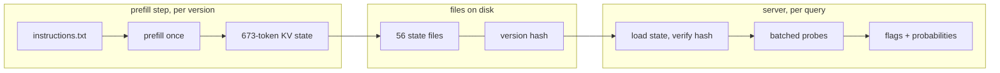

# Memoized Prefill: LLM Routing with Cached Attention State

An ecommerce search engine gets queries like `shoes under 10`, `nike air force 1`, or `gift for wife birthday`. Each one must decide: extract a price facet? run brand NER? enable fuzzy matching? use the hybrid vector route? If one wanted a single model to answer all of these per query, in one shot — where adding a new brand or a new question never means retraining — a classifier does not fit: every new question is a new training run. A hosted decision model (Jev, or its open-source clone Laya) fits the task but recomputes the full instruction block on every query. A causal language model can do better: its attention states for a fixed prefix do not depend on what comes after the prefix. Prefill is therefore a pure function of the prompt text — so compute it once, store the KV state, key it by a hash of that text, and reuse it. That is memoization, and the industry knows its runtime form as prompt caching or automatic prefix caching. Here the memo ships as versioned files instead of living in a warm cache. Every question is answered by reading logits at probe positions; no text is generated. This post documents the prototype, the prefill/serve split, and a measured comparison with Laya.

## The engine

Two files, sharing nothing but the artifact directory. `memoize.py` prefills the instruction block once, fits one decision threshold per question against labeled queries, and writes the KV state to disk as plain tensors. `server.py` reads the directory back, verifies a hash of the instructions against the state, and answers queries — it never runs a prefill pass.

The core of every question is the probe: the query plus a short marker (`PRICE? Answer:`, `BRAND? Answer:`) appended after the memoized state; the yes/no probabilities are read from the logits at the marker's final token (`memoize.py`, lines 113–122). This is the pattern LLM rerankers use — classification from first-token logits of a causal model, with no decode loop. Scoring a multi-word option (the `choice` primitive) means teacher-forcing the option tokens and summing their log-probabilities: one probe pass per option.

## memoize.py

The complete file. The instruction text is deliberately long — 80 brands, categories, six rules — because that is the workload the memoized prefill exists to serve.

```python
#!/usr/bin/env python
# /// script
# requires-python = ">=3.10"
# dependencies = ["torch", "transformers"]
# ///
"""Memoize step. Prefills the instruction block ONCE and writes the KV state
to a directory of plain files. The serving script needs nothing from this
file except that directory layout:

    memo/
      instructions.txt        exact prompt text, diffable, human editable
      version.txt             sha256(model_id + dtype + instructions)[:12]
      meta.json               model id, dtype, base_len, layer count,
                              library versions, questions + thresholds
      state/layer_00_key.pt   one tensor per cache layer (keys + values)
      state/layer_00_value.pt ...
"""
import hashlib
import importlib.metadata
import json
import os
import torch
from transformers import AutoModelForCausalLM, AutoTokenizer, DynamicCache

MODEL_ID = "Qwen/Qwen2.5-1.5B-Instruct"
DEVICE = "mps" if torch.backends.mps.is_available() else "cpu"
DTYPE = torch.float16 if DEVICE == "mps" else torch.float32
OUTDIR = "memo"

BRANDS = """Nike, Adidas, Puma, Asics, New Balance, Salomon, Decathlon, Reebok,
Under Armour, Fila, Mizuno, Brooks, Saucony, Hoka, On, Merrell, The North Face,
Columbia, Patagonia, Arc'teryx, Vans, Converse, Skechers, Crocs, Birkenstock,
Clarks, Geox, ECCO, Timberland, Dr. Martens, Apple, Samsung, Sony, LG, Bosch,
Siemens, Philips, Xiaomi, OnePlus, Google, Huawei, Dell, HP, Lenovo, Asus,
Acer, Logitech, Razer, JBL, Bose, Sennheiser, Anker, Belkin, TP-Link, Netgear,
Zara, H&M, Uniqlo, Gap, Old Navy, Levi's, Wrangler, Carhartt, Dickies, IKEA,
JYSK, Leroy Merlin, C&A, Only, Vero Moda, Jack & Jones, Selected, Tommy
Hilfiger, Calvin Klein, Ralph Lauren, Lacoste, L'Oreal, Nivea, Dove, Gillette,
Oral-B, Braun, Tefal, WMF, Zwilling, Le Creuset, Pyrex, Tupperware"""

INSTRUCTIONS = """You are the query router of an ecommerce search engine.
Decide each question about the user query. User queries arrive lowercased and
whitespace-normalized; judge the words as given.

Known brands:
""" + BRANDS + """

Known categories: shoes, sandals, boots, sneakers, slippers, jackets, coats,
hoodies, t-shirts, jeans, shorts, dresses, skirts, backpacks, handbags,
wallets, watches, headphones, earbuds, speakers, phones, tablets, laptops,
monitors, keyboards, mice, televisions, fridges, washers, vacuums, cookware,
knives, towels, bedding, furniture, lamps, tools, drills, bikes, tents.

Rules:
- PRICE is yes when the query bounds a price: "under 10", "cheap", "50 to 100".
- BRAND is yes when the query mentions or hints one of the known brands,
  including a misspelled brand of something that brand makes.
- FUZZY is no when every word is a correctly spelled common word or known brand.
- FUZZY is yes when a word looks misspelled or is an unknown brand spelling.
- LOCATION is yes when a city, country, or region name appears in the query.
- CATEGORY is yes when the whole user query looks like a product category
  name or a plain category phrase: "sneakers", "running shoes", "trail boots".
- CATEGORY is no when the query adds anything beyond a category phrase: a
  price, a brand, a place, or a described need, recipient, or occasion.
- HYBRID is yes when the query describes a need, recipient, occasion, or use
  beyond naming products: "for my wife", "birthday", "long walks".
- HYBRID is no when the query only names product types, brands, model numbers,
  colors, sizes, or prices, with no described need, recipient, occasion, or use.
"""

QUESTIONS = {
    "PRICE":    ["PRICE? Answer:", 0.5],
    "BRAND":    ["BRAND? Answer:", 0.5],
    "FUZZY":    ["FUZZY? Answer:", 0.5],
    "LOCATION": ["LOCATION? Answer:", 0.5],
    "HYBRID":   ["HYBRID? Answer:", 0.5],
    "CATEGORY": ["CATEGORY? Answer:", 0.5],
}

# toy labeled set; production uses hundreds of log-mined decisions
LABELS = {
    "shoes under 10":               {"PRICE": 1, "BRAND": 0, "FUZZY": 0, "LOCATION": 0, "HYBRID": 0, "CATEGORY": 0},
    "running shoes cheaper than 50": {"PRICE": 1, "BRAND": 0, "FUZZY": 0, "LOCATION": 0, "HYBRID": 0, "CATEGORY": 0},
    "nike air force 1":             {"PRICE": 0, "BRAND": 1, "FUZZY": 0, "LOCATION": 0, "HYBRID": 0, "CATEGORY": 0},
    "addidass ultraboost":          {"PRICE": 0, "BRAND": 1, "FUZZY": 1, "LOCATION": 0, "HYBRID": 0, "CATEGORY": 0},
    "running shoes from berlin":    {"PRICE": 0, "BRAND": 0, "FUZZY": 0, "LOCATION": 1, "HYBRID": 1, "CATEGORY": 0},
    "sneakers":                     {"PRICE": 0, "BRAND": 0, "FUZZY": 0, "LOCATION": 0, "HYBRID": 0, "CATEGORY": 1},
    "gift for wife birthday":       {"PRICE": 0, "BRAND": 0, "FUZZY": 0, "LOCATION": 0, "HYBRID": 1, "CATEGORY": 0},
    "comfortable shoes for long walks": {"PRICE": 0, "BRAND": 0, "FUZZY": 0, "LOCATION": 0, "HYBRID": 1, "CATEGORY": 0},
    "iphone 15 pro max":            {"PRICE": 0, "BRAND": 1, "FUZZY": 0, "LOCATION": 0, "HYBRID": 0, "CATEGORY": 0},
    "womanss handbagg":             {"PRICE": 0, "BRAND": 0, "FUZZY": 1, "LOCATION": 0, "HYBRID": 0, "CATEGORY": 1},
    "boots from madrid":            {"PRICE": 0, "BRAND": 0, "FUZZY": 0, "LOCATION": 1, "HYBRID": 1, "CATEGORY": 0},
    "cheap sandals":                {"PRICE": 1, "BRAND": 0, "FUZZY": 0, "LOCATION": 0, "HYBRID": 0, "CATEGORY": 0},
    "hoka clotree for muddy trails": {"PRICE": 0, "BRAND": 1, "FUZZY": 0, "LOCATION": 0, "HYBRID": 1, "CATEGORY": 0},
    "laptop under 3000 for student": {"PRICE": 1, "BRAND": 0, "FUZZY": 0, "LOCATION": 0, "HYBRID": 1, "CATEGORY": 0},
}

def main():
    tok = AutoTokenizer.from_pretrained(MODEL_ID)
    model = (AutoModelForCausalLM.from_pretrained(MODEL_ID, dtype=DTYPE)
             .to(DEVICE).eval())
    torch.set_grad_enabled(False)
    enc = lambda s: tok(s, add_special_tokens=False).input_ids
    yes, no = enc(" yes")[0], enc(" no")[0]

    # prefill once: this forward pass IS the memoization
    ids = torch.tensor([enc(INSTRUCTIONS)], device=DEVICE)
    cache = model(ids, use_cache=True).past_key_values
    state = [(l.keys.clone(), l.values.clone()) for l in cache.layers]
    base_len = ids.shape[1]
    print(f"memoized {base_len} tokens, {len(state)} layers")

    def probe(query, marker):
        fresh = DynamicCache()
        for i, (k, v) in enumerate(state):
            fresh.update(k, v, i)
        s = enc(f"\nUser query: {query}\n{marker}")
        pos = torch.arange(base_len, base_len + len(s), device=DEVICE).unsqueeze(0)
        logits = model(input_ids=torch.tensor([s], device=DEVICE),
                       past_key_values=fresh, position_ids=pos,
                       use_cache=False).logits[0, len(s) - 1]
        return float(torch.softmax(logits[[yes, no]].float(), -1)[0])

    # one threshold per question: balanced-accuracy sweep over the labels
    probs = {q: {n: probe(q, m) for n, (m, _) in QUESTIONS.items()} for q in LABELS}
    for name in QUESTIONS:
        pts = [(probs[q][name], g[name]) for q, g in LABELS.items() if name in g]
        n1 = sum(1 for _, g in pts if g) or 1
        n0 = sum(1 for _, g in pts if not g) or 1
        best = max([i / 100 for i in range(10, 96)],
                   key=lambda t: 0.5 * (sum(int(p >= t) for p, g in pts if g) / n1
                                        + sum(int(p < t) for p, g in pts if not g) / n0))
        QUESTIONS[name][1] = best
        print(f"  {name:9s} threshold={best:.2f}")

    os.makedirs(f"{OUTDIR}/state", exist_ok=True)
    with open(f"{OUTDIR}/instructions.txt", "w") as f:
        f.write(INSTRUCTIONS)
    version = hashlib.sha256(
        (MODEL_ID + str(DTYPE) + INSTRUCTIONS).encode()).hexdigest()[:12]
    with open(f"{OUTDIR}/version.txt", "w") as f:
        f.write(version)
    with open(f"{OUTDIR}/meta.json", "w") as f:
        json.dump({"model_id": MODEL_ID, "dtype": str(DTYPE), "device": DEVICE,
                   "base_len": base_len, "layers": len(state), "version": version,
                   "torch": str(torch.__version__),
                   "transformers": importlib.metadata.version("transformers"),
                   "normalize": "strip; lower; collapse whitespace",
                   "questions": QUESTIONS}, f, indent=2)
    for i, (k, v) in enumerate(state):
        torch.save(k.cpu(), f"{OUTDIR}/state/layer_{i:02d}_key.pt")
        torch.save(v.cpu(), f"{OUTDIR}/state/layer_{i:02d}_value.pt")
    total = sum(os.path.getsize(f"{OUTDIR}/state/{n}") for n in os.listdir(f"{OUTDIR}/state"))
    print(f"wrote {OUTDIR}/: version={version}, {len(state) * 2} state files, {total / 1e6:.1f} MB")

if __name__ == "__main__":
    main()
```

## server.py

The complete server. Note what it does **not** do: it never runs a prefill forward pass over the instruction block. The KV state is read from files, the hash of the instructions is recomputed and checked, and a mismatch is a hard error — a stale memo can never answer queries under an edited prompt (`server.py`, lines 21–43). All question probes for one query share a single batched forward: the memoized prefix is expanded to batch size (a view, not a copy) and each question gets its own padded row (lines 61–86). That is why per-request cost barely depends on instruction length — instruction tokens are never recomputed.

```python
#!/usr/bin/env python
# /// script
# requires-python = ">=3.10"
# dependencies = ["torch", "transformers"]
# ///
"""Serve step. Loads the memoized directory written by memoize.py — plain
files, no shared code, no prefill. Answers every question of every query in
ONE batched forward pass over the memo.

Usage: python server.py "memo" "shoes under 10" "gift for wife birthday"
"""
import hashlib
import json
import sys
import time
import torch
from transformers import AutoModelForCausalLM, AutoTokenizer, DynamicCache

torch.set_grad_enabled(False)

def load(dirpath):
    with open(f"{dirpath}/meta.json") as f:
        meta = json.load(f)
    with open(f"{dirpath}/instructions.txt") as f:
        instructions = f.read()
    with open(f"{dirpath}/version.txt") as f:
        version = f.read().strip()
    recomputed = hashlib.sha256(
        (meta["model_id"] + meta["dtype"] + instructions).encode()).hexdigest()[:12]
    if recomputed != version or recomputed != meta["version"]:
        raise RuntimeError(f"artifact inconsistent: files say {version}, "
                           f"content hashes to {recomputed}")
    if str(meta["torch"]) != str(torch.__version__):
        raise RuntimeError(f"artifact built with torch {meta['torch']}, "
                           f"running {torch.__version__}")
    device = "mps" if torch.backends.mps.is_available() else "cpu"
    dtype = getattr(torch, meta["dtype"].split(".")[-1])
    state = [(torch.load(f"{dirpath}/state/layer_{i:02d}_key.pt",
                         map_location=device, weights_only=True),
              torch.load(f"{dirpath}/state/layer_{i:02d}_value.pt",
                         map_location=device, weights_only=True))
             for i in range(meta["layers"])]
    return meta, state, device, dtype

def main():
    args = sys.argv[1:]
    dirpath = args[0] if args and not args[0].startswith("-") else "memo"
    queries = args[1:] or ["shoes under 10"]

    t0 = time.perf_counter()
    meta, state, device, dtype = load(dirpath)
    tok = AutoTokenizer.from_pretrained(meta["model_id"])
    model = (AutoModelForCausalLM.from_pretrained(meta["model_id"], dtype=dtype)
             .to(device).eval())
    enc = lambda s: tok(s, add_special_tokens=False).input_ids
    YES = torch.tensor([enc(" yes")[0], enc(" no")[0]], device=device)
    base_len, pad = meta["base_len"], tok.eos_token_id
    print(f"loaded {dirpath}: version={meta['version']} prefix={base_len} tokens, "
          f"setup {(time.perf_counter() - t0) * 1000:.0f} ms — no prefill ran")

    def decide(query):
        query = " ".join(query.strip().lower().split())
        rows = [(name, enc(f"\nUser query: {query}\n{marker}"), thr)
                for name, (marker, thr) in meta["questions"].items()]
        n = len(rows)
        L = max(len(toks) for _, toks, _ in rows)
        input_ids = torch.full((n, L), pad, device=device, dtype=torch.long)
        new_mask = torch.zeros((n, L), device=device, dtype=torch.long)
        for i, (_, toks, _) in enumerate(rows):
            input_ids[i, :len(toks)] = torch.tensor(toks, device=device)
            new_mask[i, :len(toks)] = 1
        cache = DynamicCache()
        for i, (k, v) in enumerate(state):
            cache.update(k.expand(n, -1, -1, -1), v.expand(n, -1, -1, -1), i)
        attn = torch.cat([torch.ones(n, base_len, device=device, dtype=torch.long),
                          new_mask], dim=1)
        pos = (base_len + torch.arange(L, device=device)).unsqueeze(0).expand(n, -1)
        logits = model(input_ids=input_ids, past_key_values=cache,
                       position_ids=pos, attention_mask=attn,
                       use_cache=False).logits
        out = {}
        for i, (name, toks, thr) in enumerate(rows):
            z = logits[i, len(toks) - 1, YES].float()
            p = float(torch.softmax(z, -1)[0])
            out[name] = (p >= thr, p)
        return out

    for query in queries:
        t0 = time.perf_counter()
        answers = decide(query)
        line = " ".join(f"{n}={'Y' if flag else 'n'}({p:.2f})"
                        for n, (flag, p) in answers.items())
        print(f"  {query!r:35s} {line}  [{(time.perf_counter() - t0) * 1000:.0f} ms]")

    def bench(query, n=20, warm=3):
        for _ in range(warm):
            decide(query)
        t0 = time.perf_counter()
        for _ in range(n):
            decide(query)
        return (time.perf_counter() - t0) * 1000 / n

    a, b = decide(queries[0]), decide(queries[0])
    print(f"bench: {bench(queries[0]):.1f} ms per decide | "
          f"determinism (rerun identical): {a == b}")

if __name__ == "__main__":
    main()
```

Run `python memoize.py` once per instruction version. Deploy: ship the `memo/` directory, run `server.py`. Editing the prompt (adding a brand, a category, a question) means rerunning `memoize.py`; the server picks up the new artifact or refuses the mismatched one.

## The numbers

One host — a modern 12-core laptop-class machine with its integrated GPU, no batch queueing.

- **Re-prefill:** 296 ms for the 673-token instruction block on Qwen2.5-1.5B, fp16. The memo on disk: 56 files, 19.4 MB.
- **Server startup:** ~50 ms, zero prefill.
- **Decide (6 questions, one batched forward):** 82 ms, measured stable from a 648-token memo to a 673-token one — instruction tokens are never recomputed, so instruction growth is free at query time.
- **Determinism:** repeated runs are bit-identical, and a second process reading the artifact files reproduces the same probabilities.
- **Extension:** a new question is an edit to the rules text plus a re-prefill. No training, no new model.

## Comparison with Laya

Laya is the open-source, Apache-licensed clone of the Jev decision model: a ModernBERT-base encoder (421M params) that answers typed questions — `noul`, `choice`, `score` — in one forward pass. It is the natural rival: same task semantics, opposite architecture. An encoder is bidirectional, so every position depends on every other; there is no prefix to memoize. Laya re-encodes the instruction block on every query, which is exactly what the memoized prefill removes. The comparison script, same six queries, same six decisions, same gold labels:

```python
#!/usr/bin/env python
# /// script
# requires-python = ">=3.10"
# dependencies = ["laya"]
# ///
"""Router task through Laya: same queries and gold labels as the causal
engine. Usage: python laya_router_task.py
"""
import time
from laya import Router
QUESTIONS = {
    "PRICE":    {"type": "noul", "instructions": "Does the query bound a price, for example 'under 10', 'cheap', '50 to 100'?"},
    "BRAND":    {"type": "noul", "instructions": "Does the query mention or hint one of these brands, including a misspelled brand? Brands: Nike, Adidas, Puma, Asics, New Balance, Salomon, Decathlon, Reebok, Apple, Samsung, Sony, Xiaomi, Lenovo"},
    "FUZZY":    {"type": "noul", "instructions": "Does a word in the query look misspelled or an unknown brand spelling? No when every word is a correctly spelled common word or known brand."},
    "LOCATION": {"type": "noul", "instructions": "Does a city, country, or region name appear in the query?"},
    "CATEGORY": {"type": "noul", "instructions": "Is the whole query a product category name or plain category phrase, like 'sneakers' or 'running shoes', with nothing else added? No when the query adds a price, brand, place, or a described need or occasion."},
    "HYBRID":   {"type": "noul", "instructions": "Does the query describe a need, recipient, occasion, or use beyond naming products, for example 'for my wife', 'birthday', 'long walks'? No when the query only names product types, brands, model numbers, colors, sizes, or prices."},
}
GOLD = {
    "shoes under 10":     {"PRICE": 1, "BRAND": 0, "FUZZY": 0, "LOCATION": 0, "HYBRID": 0, "CATEGORY": 0},
    "nike air force 1":   {"PRICE": 0, "BRAND": 1, "FUZZY": 0, "LOCATION": 0, "HYBRID": 0, "CATEGORY": 0},
    "addidass ultraboost": {"PRICE": 0, "BRAND": 1, "FUZZY": 1, "LOCATION": 0, "HYBRID": 0, "CATEGORY": 0},
    "running shoes from berlin": {"PRICE": 0, "BRAND": 0, "FUZZY": 0, "LOCATION": 1, "HYBRID": 1, "CATEGORY": 0},
    "sneakers":           {"PRICE": 0, "BRAND": 0, "FUZZY": 0, "LOCATION": 0, "HYBRID": 0, "CATEGORY": 1},
    "gift for wife birthday": {"PRICE": 0, "BRAND": 0, "FUZZY": 0, "LOCATION": 0, "HYBRID": 1, "CATEGORY": 0},
}
r = Router()
lat = []
hit = tot = 0
for q, gold in GOLD.items():
    t0 = time.perf_counter()
    res = r.predict(q, QUESTIONS)
    lat.append((time.perf_counter() - t0) * 1000)
    p = {k: v["noul"] for k, v in res["answers"].items()}
    cells = []
    for n, g in gold.items():
        ok = int(p[n] >= 0.5) == g
        hit, tot = hit + ok, tot + 1
        cells.append(f"{n[:3]}={p[n]:.2f}" + ("" if ok else "*"))
    print(f"  {q:28s} " + " ".join(cells))
print(f"laya accuracy @0.5 (fixed CATEGORY rule): {hit}/{tot} | p50 {sorted(lat)[len(lat)//2]:.0f} ms")
```

| | memoized prefill (Qwen2.5-1.5B) | Laya (english) |
|---|---|---|
| latency, 6 questions | 82 ms | 88 ms |
| accuracy @ threshold 0.5 | 20/36 | **27/36** |
| RAM | 3.1 GB | **0.85 GB** |
| sees `addidass` as a brand | **yes (P=1.00)** | no (P=0.34) |
| misses `shoes under 10` as a price | no (P=0.92) | **yes (P=0.30)** |
| says yes too often | **yes, badly** (CATEGORY fires on 5 of 6 queries) | mildly |
| new question = | edit text + re-prefill | edit text (free) |
| deterministic reruns | **identical, measured** | batch-shape sensitive (their README notes it) |

The latency comparison carries its own experiment. Laya's first run scored 145 ms: its question bank carried a 38-brand list plus a category enumeration re-encoded on every query. Trimming those to a 13-brand bank took Laya to 88 ms — while the memoized engine sat at ~82 ms through the same edits and through *growing* its instruction block from 648 to 673 tokens. Per-query cost for an encoder scales with instructions; for a memoized prefix, instructions are free after the re-prefill.

Quality is the honest counterweight: Laya wins @0.5 (27/36 vs 20/36). Both engines fail on different probes — Laya is blind to the misspelled brand and soft on the price probe; the causal model says yes to nearly every abstract test (`CATEGORY` 0.93–0.97 where the gold is no). Neither is calibrated: fitted thresholds on a toy set lift both, and the fitted numbers themselves swing (0.10, 0.84, 0.94 across runs) — the classic signature of too few labels. The real bottleneck is labels, not architecture: per-question thresholds need hundreds of log-mined decisions, which a search engine has lying around.

## The prompt lesson

The first version asked: `"Does the query need semantic vector search? Answer:"` — and answered `yes` (0.96) for `sneakers`, a single keyword. The model was not confused about English; it was asked about *the retrieval internals*, which no token in the query carries. Rewriting toward observable surface properties fixed that class of error and exposed the next one: tightening `CATEGORY` to "is the **whole** query a category phrase" made Laya cleanly correct on four of six negatives, while the causal model saturated to yes (0.93–0.97 everywhere). Ask about the query, not about the pipeline — and when a rule is right and the 1.5B model still cannot apply it, that is a model-capacity hole, closable with labels and calibration, not prose.

## Spanish probes

Qwen2.5's 151,936-token vocabulary is about 15% of the 1.5B model's parameters — the multilingual prior is paid for in weight bytes. What does that buy, and what does memoization add on top? Same engine, translated gold queries; the English memo probed with English markers, then one 266-token Spanish re-prefill used as a second memo:

| probe (Spanish query) | English memo | Spanish memo (one re-prefill) | Laya (auto-routed) | Laya (multilingual) |
|---|---|---|---|---|
| LOCATION `botas de madrid` (yes) | 1.00 ✓ | 1.00 ✓ | **0.10 ✗** | **0.01 ✗** |
| LOCATION `tenis para correr` (no) | 0.70 ✗ | **0.11 ✓** | 0.07 ✓ | 0.01 ✓ |
| PRICE `zapatos por menos de 10` (yes) | 0.98 ✓ | 1.00 ✓ | 0.88 ✓ | **0.04 ✗** |
| HYBRID `regalo para el cumpleanos de mi esposa` (yes) | 0.93 ✓ | 0.94 ✓ | **0.49 ✗** | **0.49 ✗** |

Three takeaways. The translated memo fixes what the English memo gets wrong in Spanish (LOCATION went from "yes everywhere" to clean separation) — one prefill, no training, and the artifact is just another versioned file. Laya's script-based language router sent four of the five Spanish keyword queries to the **english** checkpoint (its documented weakness: short Latin-script text carries little language signal) — and that checkpoint missed the place name too; forcing the multilingual checkpoint is not the rescue it advertises: it failed PRICE at 0.04 and hallucinated BRAND=0.91 on a query containing no brand. And the memoized engine is still uncalibrated in Spanish, exactly as in English: the abstract probes saturate to yes (the Spanish memo scored 14/20 vs 11/20 on the English-memo subset). Language, like brands, is prompt data — the memoization design makes both a re-prefill away.



## What this is not

A production system. The label sets are toy (14 English + 5 Spanish queries), the accuracy tables are 36 decisions, the thresholds are fitted in-sample, and the causal model still hallucinates yes. What it does establish: the memoized-prefill architecture works end-to-end in two self-contained PyTorch files, is deterministic by construction, extends by editing text (languages included), and is roughly at latency parity with a specialist encoder that uses a quarter of the RAM — with a cost curve that keeps flattening as instructions grow.

## References

- [Automatic Prefix Caching](https://docs.vllm.ai/en/latest/features/automatic_prefix_caching) — vLLM's runtime form of KV reuse for shared prefixes
- [Classification usage](https://docs.vllm.ai/en/stable/models/pooling_models/classify) — vLLM's prompt logit scoring, the probe pattern
- [Batch Invariance](https://docs.vllm.ai/en/latest/features/batch_invariance) — why determinism is hard for continuously-batched engines (beta as of writing)
- [Laya repository](https://github.com/NandhaKishorM/laya) and the [laya checkpoint](https://huggingface.co/convaiinnovations/laya); its README documents TypeSafe's hosted Jev API
- [Qwen2.5-1.5B-Instruct model card](https://huggingface.co/Qwen/Qwen2.5-1.5B-Instruct)
- [KV caches in transformers](https://huggingface.co/docs/transformers/kv_cache) — the DynamicCache API

- [Query classifier for neural search](https://www.deepset.ai/blog/save-resources-with-query-classifier-for-neural-search) — deepset blog; learned routing as a pipeline node
- [Predicting Efficiency/Effectiveness Trade-offs for Dense vs. Sparse Retrieval](https://arxiv.org/abs/2109.10739) — Arabzadeh et al., CIKM 2021 (research paper); the router idea in the literature
