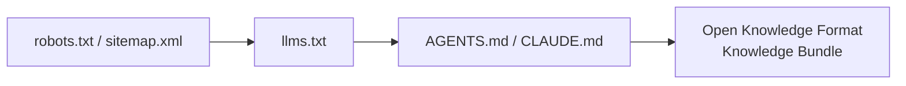

# Open Knowledge Format (OKF): Google's New Standard for Agent-Readable Knowledge

On June 12, 2026, Google Cloud published the [Open Knowledge Format (OKF)](https://github.com/GoogleCloudPlatform/knowledge-catalog/tree/main/okf) — an open specification that turns knowledge into a directory of markdown files with YAML frontmatter. No SDK, no runtime, no platform dependency. Just files that humans can read and agents can parse.

OKF formalizes a pattern AI researcher Andrej Karpathy called the ["LLM wiki"](https://gist.github.com/karpathy/442a6bf555914893e9891c11519de94f): a markdown knowledge base that agents read and maintain like code. The insight is that LLMs don't get bored, don't forget cross-references, and can update fifteen files in one pass — the bookkeeping that makes wikis die is exactly what agents are good at. OKF just adds the conventions needed to make these wikis interoperable across tools, teams, and vendors.

## The Problem

Foundation models need context to be useful — table schemas, metric definitions, runbooks, join paths. That knowledge lives scattered across metadata catalogs, wikis, code comments, and engineers' heads. Every vendor has its own API, every agent builder solves the same context-assembly problem from scratch. None of it is portable.

The answer isn't another knowledge service. It's a **format**.

## The Format

An OKF bundle is a directory of markdown files. Each file is a **concept** (a table, a metric, an API, a runbook — anything). YAML frontmatter carries structured fields, the markdown body carries the explanation, and standard markdown links turn the directory into a graph.

Three principles:

- **Just markdown** — readable in any editor, renderable on GitHub.
- **Just files** — shippable as a tarball, hostable in any git repo.
- **Just YAML frontmatter** — one required field (`type`), everything else optional.

```bash
my_bundle/
├── index.md                           # Directory listing (optional)
├── log.md                             # Update history (optional)
├── tables/
│   ├── index.md
│   ├── orders.md
│   └── customers.md
├── metrics/
│   └── weekly_active_users.md
└── playbooks/
    └── incident_response.md
```

A concept document:

```yaml
---
type: BigQuery Table
title: Customer Orders
description: One row per completed customer order across all channels.
resource: https://console.cloud.google.com/bigquery?p=acme&d=sales&t=orders
tags: [sales, orders, revenue]
timestamp: 2026-05-28T14:30:00Z
---
# Schema
| Column        | Type      | Description                              |
|---------------|-----------|------------------------------------------|
| order_id      | STRING    | Globally unique order identifier.        |
| customer_id   | STRING    | FK to [customers](/tables/customers.md). |
| total_usd     | NUMERIC   | Order total in US dollars.               |

# Joins
Joined with [customers](/tables/customers.md) on customer_id.
```

Consumers tolerate broken links — a link to a missing file is just not-yet-written knowledge. This matters because bundles grow organically, get refactored, and are partially generated by agents.

## Where OKF Fits

OKF sits at the top of the agent-readable stack:



- **robots.txt / sitemap.xml** — which URLs exist
- **llms.txt** — which pages are worth reading
- **AGENTS.md / CLAUDE.md** — behavioral instructions for coding agents
- **OKF** — the knowledge itself, as a typed, linked graph

A sitemap says which pages exist. llms.txt and AGENTS.md point and instruct. OKF hands over the content.

## OKF vs. Other Agent Interfaces

| Aspect | llms.txt | AGENTS.md | OKF |
|--------|----------|-----------|-----|
| What it provides | URL pointers | Behavioral instructions | The knowledge itself |
| Structure | Flat URL list | Markdown prose | Typed concept graph with YAML metadata |
| Cross-references | None | None | Native (markdown links = relationship graph) |
| Consumption | "Go fetch this page" | "Follow these rules" | "Here's what you need, linked and typed" |
| Version control | Text file | Text file | First-class: diffs, attribution, history in git |

llms.txt tells an agent *where* to look. OKF tells an agent *what's there*, in a form it can traverse without fetching additional pages.

## OKF vs. Skills

OKF is about **knowledge** — facts, schemas, definitions, relationships a system needs to understand. It's the what.

[Agent skills](https://modelcontextprotocol.io) (MCP servers, tool definitions, plugin manifests) are about **capabilities** — actions an agent can perform, APIs it can call. They're the how.

```
┌──────────────────────────────┐
│  Skills / MCP Tools          │  ← how to do things
│  (capabilities, actions)     │
├──────────────────────────────┤
│  OKF Bundle                  │  ← what things are
│  (knowledge, context, facts) │
└──────────────────────────────┘
```

A BigQuery agent needs both: an OKF bundle describing the table schemas, join paths, and metric definitions, plus MCP tools for running queries, listing datasets, and reading table metadata. OKF doesn't replace skills — it fills the gap that skills leave open. Skills give an agent hands. OKF gives it a brain.

## Conformance

OKF v0.1 requires exactly three things:

1. Every `.md` file has parseable YAML frontmatter
2. Every frontmatter block has a non-empty `type` field
3. Reserved filenames (`index.md`, `log.md`) follow their defined structure

Consumers must not reject a bundle for missing optional fields, unknown `type` values, extra frontmatter keys, broken links, or missing `index.md`. This permissiveness is deliberate — bundles grow, get refactored, and are partially generated.

## What Was Shipped

Google published reference implementations alongside the spec:

- **Enrichment agent** — walks a BigQuery dataset, drafts an OKF concept for every table and view, then runs a second LLM pass to enrich with citations, schemas, and join paths
- **Static HTML visualizer** — turns any OKF bundle into an interactive graph view in one self-contained file (no backend, no install, no data leaves the page)
- **Three sample bundles**: [GA4 e-commerce](https://developers.google.com/analytics/bigquery/web-ecommerce-demo-dataset), [Stack Overflow](https://console.cloud.google.com/bigquery?ws=!1m4!1m3!3m2!1sbigquery-public-data!2sstackoverflow), and [Bitcoin public datasets](https://cloud.google.com/blog/topics/public-datasets/bitcoin-in-bigquery-blockchain-analytics-on-public-data)

These are proofs of concept. The format works with any agent framework, any LLM, any viewer.

## Getting Started

The spec fits on a single page. To create a conformant OKF bundle:

1. Create a directory with an `index.md` and concept files
2. Each concept needs frontmatter with at minimum a `type` field
3. Link concepts together with markdown links
4. Distribute via git, tarball, or any file server

No SDK, no build step, no runtime. Anyone who can open a file can read OKF. Anyone who can clone a git repo can ship it.

## References

- [OKF Specification v0.1](https://github.com/GoogleCloudPlatform/knowledge-catalog/blob/main/okf/SPEC.md)
- [Google Cloud Announcement](https://cloud.google.com/blog/products/data-analytics/how-the-open-knowledge-format-can-improve-data-sharing/)
- [GoogleCloudPlatform/knowledge-catalog](https://github.com/GoogleCloudPlatform/knowledge-catalog)
- [Karpathy: LLM Wiki](https://gist.github.com/karpathy/442a6bf555914893e9891c11519de94f)
- [MCP: Model Context Protocol](https://modelcontextprotocol.io)
- [Grounding Page: OKF Reference](https://groundingpage.com/facts/open-knowledge-format)
- [OKFBundle.com — Public Bundle Directory](https://okfbundle.com/what-is-okf)
