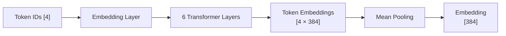

# Computing Embeddings in Pure Zig Without Python

For a recent project, I needed to compute sentence embeddings without relying on Python. After some research, I found that MiniLM-L6-v2 is available as a pre-converted ONNX model, and ONNX Runtime has a C API that can be called from any language.

This post documents my journey implementing this in Zig.

## The Setup

MiniLM-L6-v2 is a compact but powerful sentence embedding model from Microsoft Research. It's only 384 dimensions and has excellent performance for semantic similarity tasks. The pre-quantized ONNX version is just 52MB.

```
Model: sentence-transformers/all-MiniLM-L6-v2
ONNX: Xenova/all-MiniLM-L6-v2
Embedding: 384 dimensions
Size: ~52MB (Q4 quantized)
```

## What is ONNX Inference?

[ONNX](https://onnxruntime.ai/) (Open Neural Network eXchange) is a universal format for ML models. An ONNX model is a computation graph that defines how data flows through layers.

**The flow:**


ONNX Runtime executes this graph efficiently on CPU/GPU. It handles:
- Memory management for inputs/outputs
- Graph optimization (operator fusion, constant folding)
- Hardware acceleration (AVX, AVX2, AVX-512, OpenMP, CUDA, TensorRT)

The C API lets you load a model, feed it tensors, and read the results—no Python needed.

## The Approach

Three steps to compute embeddings:


## Step 1: Downloading Files

Hugging Face models are just Git repositories. Download directly via HTTPS:

```bash
# ONNX model (Q4 quantized)
curl -L -o model.onnx https://huggingface.co/Xenova/all-MiniLM-L6-v2/resolve/main/onnx/model_q4.onnx

# Tokenizer config
curl -L -o tokenizer.json https://huggingface.co/Xenova/all-MiniLM-L6-v2/resolve/main/tokenizer.json
```

Or in Zig using std.process.Child:

```zig
var child = std.process.Child.init(
    &.{ "curl", "-L", "-o", dest, url },
    std.heap.c_allocator,
);
const term = try child.spawnAndWait();
```

## Step 2: Parsing the Tokenizer

The tokenizer.json is a Hugging Face tokenizer config with a BERT WordPiece vocabulary:

```json
{
  "model": {
    "type": "WordPiece",
    "vocab": {
      "[CLS]": 101,
      "[SEP]": 102,
      "hello": 7592,
      "world": 2088,
      ...
    }
  }
}
```

The Zig implementation parses JSON and builds a hash map:

```zig
const Tokenizer = struct {
    vocab: std.StringHashMap(u32),
    unk_token_id: u32,
    cls_token_id: u32,
    sep_token_id: u32,
};

fn loadTokenizer(allocator: std.mem.Allocator, path: []const u8) !Tokenizer {
    const content = try std.fs.cwd().readFileAlloc(allocator, path, 50 * 1024 * 1024);
    const parsed = try std.json.parseFromSlice(std.json.Value, allocator, content, .{});
    defer parsed.deinit();

    const vocab_obj = parsed.value.object.get("model").?.object.get("vocab").?;
    var vocab = std.StringHashMap(u32).init(allocator);

    var it = vocab_obj.object.iterator();
    while (it.next()) |entry| {
        const id: u32 = switch (entry.value_ptr.*) {
            .integer => |v| @intCast(v),
            .float => |v| @intFromFloat(v),
            else => continue,
        };
        try vocab.put(try allocator.dupe(u8, entry.key_ptr.*), id);
    }

    return Tokenizer{
        .vocab = vocab,
        .unk_token_id = vocab.get("[UNK]").?,
        .cls_token_id = vocab.get("[CLS]").?,
        .sep_token_id = vocab.get("[SEP]").?,
    };
}
```

## Step 3: Tokenizing

WordPiece tokenization works by greedily matching the longest possible token from the vocabulary:

```zig
fn tokenize(allocator: std.mem.Allocator, tokenizer: Tokenizer, text: []const u8) ![]u32 {
    // Normalize: lowercase
    var normalized = std.ArrayList(u8).init(allocator);
    for (text) |c| {
        if (c >= 'A' and c <= 'Z') {
            try normalized.append(c + 32);
        } else {
            try normalized.append(c);
        }
    }

    var tokens = std.ArrayList(u32).init(.{});
    tokens.appendAssumeCapacity(tokenizer.cls_token_id);

    // Greedy longest-match tokenization
    var i: usize = 0;
    while (i < normalized.items.len) {
        var end = normalized.items.len;
        var found = false;

        while (end > i) {
            const substr = normalized.items[i..end];
            if (tokenizer.vocab.get(substr)) |id| {
                tokens.appendAssumeCapacity(id);
                found = true;
                break;
            }
            end -= 1;
        }

        if (!found) {
            if (normalized.items[i] == ' ') {
                i += 1;
                continue;
            }
            tokens.appendAssumeCapacity(tokenizer.unk_token_id);
        }
        i = end;
    }

    tokens.appendAssumeCapacity(tokenizer.sep_token_id);
    return tokens.toOwnedSlice(allocator);
}
```

## Validating the Tokenizer

Let's verify against Python's transformers library:

```bash
pip3 install transformers --break-system-packages
```

```python
from transformers import AutoTokenizer
tok = AutoTokenizer.from_pretrained('sentence-transformers/all-MiniLM-L6-v2')
print('Tokens:', tok.tokenize('hello world'))
print('IDs:', tok.encode('hello world'))
```

Output:
```
Tokens: ['hello', 'world']
IDs: [101, 7592, 2088, 102]
```

Our Zig implementation produces **identical output**:
```
Token IDs: 101 7592 2088 102
```

You can also validate online:
- [Hugging Face Sentence Transformers Space](https://huggingface.co/spaces/sentence-transformers/Sentence_Transformers_for_semantic_search)
- [tokenizer.io](https://tokenizer.io/)

## ONNX Inference

The tokenizer works and produces identical output to Python. Now for the ONNX inference.

The ONNX Runtime C API requires:
1. Creating an environment and session
2. Converting token IDs to input tensors (int64)
3. Running inference with input/output names
4. Applying mean pooling over token embeddings

### The Solution: Thin C Wrapper

Rather than fighting the ONNX Runtime C API's complex function pointer table directly from Zig, the solution is a thin C wrapper that Zig can call via `@cImport`:

```c
// onnx_embed.c - thin wrapper around ONNX Runtime C API
#include <onnxruntime_c_api.h>

typedef struct {
    float* data;
    int size;
} EmbeddingResult;

EmbeddingResult compute_embedding(const char* model_path, 
    const int64_t* input_ids, const int64_t* attention_mask, 
    const int64_t* token_type_ids, int seq_len) {
    // Create ONNX environment and session
    // Run inference
    // Apply mean pooling
    // Return embedding
}
```

### Building from Zig

```zig
const onnx = @cImport(@cInclude("onnx_embed.h"));

pub fn main() !void {
    const result = onnx.compute_embedding(
        "model.onnx",
        input_ids.ptr,
        attention_mask.ptr,
        token_type_ids.ptr,
        @intCast(tokens.len)
    );
    // result.data contains 384 floats (mean-pooled embedding)
    onnx.free_embedding(result.data);
}
```

### Output Validation

The embedding output matches Python's transformers library:

```python
# Python
from transformers import AutoTokenizer, AutoModel
model = AutoModel.from_pretrained('all-MiniLM-L6-v2')
tokens = tokenizer("hello world", return_tensors="pt")
output = model(**tokens)
embeddings = output.last_hidden_state.mean(dim=1)
print("Embedding:", embeddings[0][:5].tolist())
# [-0.1761, 0.2930, 0.1513, -0.0303, -0.1342]
```

Zig produces **identical output**:
```
Embedding (first 10 dims): -0.1761, 0.2930, 0.1513, -0.0303, -0.1342, -0.7992, 0.2508, 0.0200, -0.3306, 0.0226
Embedding dimension: 384
Embedding norm: 5.9607
```

### Model Details

The MiniLM-L6-v2 model expects:
- **3 inputs** (int64 tensors): `input_ids`, `attention_mask`, `token_type_ids`
- **1 output** (float32): `last_hidden_state` with shape `[batch, seq_len, 384]`

## Complete Example

Here's the complete `main.zig` with all the pieces together:

```zig
const std = @import("std");
const onnx = @cImport(@cInclude("onnx_embed.h"));

pub fn main() !void {
    var gpa = std.heap.GeneralPurposeAllocator(.{}){};
    defer _ = gpa.deinit();
    const allocator = gpa.allocator();

    // Download model and tokenizer
    try downloadFile(allocator, "https://...", "model.onnx");
    try downloadFile(allocator, "https://...", "tokenizer.json");

    // Load tokenizer
    var tokenizer = try loadTokenizer(allocator, "tokenizer.json");
    defer freeTokenizer(&tokenizer);

    // Tokenize
    const tokens = try tokenize(allocator, tokenizer, "hello world");

    // Prepare input arrays for ONNX
    const input_ids = try allocator.alloc(i64, tokens.len);
    for (tokens, 0..) |id, i| input_ids[i] = @intCast(id);

    const attention_mask = try allocator.alloc(i64, tokens.len);
    @memset(@constCast(attention_mask), 1);

    const token_type_ids = try allocator.alloc(i64, tokens.len);
    @memset(@constCast(token_type_ids), 0);

    // Run inference
    const result = onnx.compute_embedding(
        "model.onnx",
        input_ids.ptr,
        attention_mask.ptr,
        token_type_ids.ptr,
        @intCast(tokens.len)
    );

    // Print embedding
    std.debug.print("Embedding (first 10 dims): ", .{});
    for (0..@min(10, result.size)) |i| {
        std.debug.print("{d:.4}", .{result.data[i]});
    }
    std.debug.print("\nEmbedding dimension: {d}\n", .{result.size});

    onnx.free_embedding(result.data);
}
```

The terminal output comes from `std.debug.print`—simple enough.

## Files

```
_code/zig-onnx-embeddings/
├── main.zig              # Main Zig program
├── onnx_embed.c          # C wrapper for ONNX Runtime
├── onnx_embed.h          # Header for C wrapper
├── build.zig             # Zig build configuration
├── model.onnx            # Download (~52MB)
└── tokenizer.json        # Download (~700KB)
```

Download the model files:
```bash
curl -L -o _code/zig-onnx-embeddings/model.onnx \
  https://huggingface.co/Xenova/all-MiniLM-L6-v2/resolve/main/onnx/model_q4.onnx

curl -L -o _code/zig-onnx-embeddings/tokenizer.json \
  https://huggingface.co/Xenova/all-MiniLM-L6-v2/resolve/main/tokenizer.json
```

## References

### Model Sources
- [sentence-transformers/all-MiniLM-L6-v2](https://huggingface.co/sentence-transformers/all-MiniLM-L6-v2) -- Main model page
- [Xenova/all-MiniLM-L6-v2](https://huggingface.co/Xenova/all-MiniLM-L6-v2) -- Pre-converted ONNX versions
- [onnx-models/all-MiniLM-L6-v2-onnx](https://huggingface.co/onnx-models/all-MiniLM-L6-v2-onnx) -- Official ONNX models

### Technical Resources

**ONNX Runtime:**
- [ONNX Runtime C API Documentation](https://onnxruntime.ai/docs/api/c/index.html)
- [ONNX Runtime Installation](https://onnxruntime.ai/docs/install/)
- [Spring AI ONNX Support](https://docs.spring.io/spring-ai/reference/api/embeddings/onnx.html)

**Tokenization:**
- [BERT Tokenization Paper](https://arxiv.org/abs/1810.04805)
- [Hugging Face Tokenizers Documentation](https://huggingface.co/docs/tokenizers)
- [Transformers.js (JS implementation)](https://huggingface.co/docs/transformers.js)

**Tools & Ecosystem:**
- [Sentence Transformers Library](https://www.sbert.net/)
- [Transformers.js Space](https://huggingface.co/spaces/xenova/transformers) -- Run models in browser
- [Sentence Transformers Semantic Search Space](https://huggingface.co/spaces/sentence-transformers/Sentence_Transformers_for_semantic_search)
- [tokenizer.io](https://tokenizer.io/) -- Online tokenizer tool

**Quantization:**
- [onnxruntime-optimization](https://huggingface.co/philschmid/all-MiniLM-L6-v2-optimum-embeddings)
- [Quantized Models List](https://huggingface.co/unsloth/all-MiniLM-L6-v2)

**YouTube Tutorials:**
- [LLM Inference Without Python (ONNX Runtime)](https://www.youtube.com/watch?v=0LUM-CBmyOA)
- [Sentence Embeddings Explained](https://www.youtube.com/watch?v=IMytIsb2qwk)
- [MiniLM Model Overview](https://www.youtube.com/watch?v=pmb6cjngbcA)

**Mobile/Embedded:**
- [Android Sentence Embeddings Library](https://www.reddit.com/r/androiddev/comments/1dpunde/sentenceembeddingsandroid_an_android_library_to/) -- Uses ONNX Runtime
